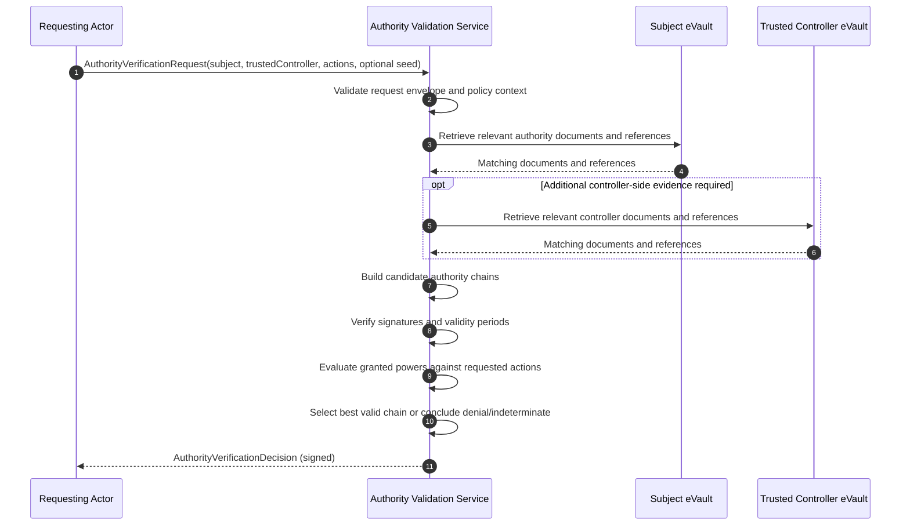
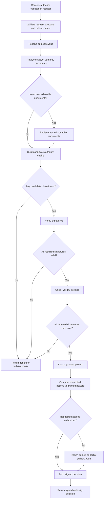

# Authority Verification Architecture

## High-Level Explanation

Authority verification is a separate subsystem that determines whether a trusted controller may perform a requested action on behalf of a subject.

The requesting actor provides only the minimal context:

- subject
- trusted controller
- requested action or actions
- optionally a seed document or reference

The Authority Validation Service then retrieves relevant authority evidence, builds candidate authority chains, validates signatures and validity periods, evaluates granted powers, and returns a signed decision.

## Main Participants

| Participant | Role |
|---|---|
| Requesting Actor | Needs an authority decision before allowing an action |
| Authority Validation Service | Retrieves evidence, builds chains, validates authority, returns signed decision |
| Subject eVault | Holds or references authority documents related to the subject |
| Trusted Controller eVault | May hold additional authority references relevant to the controller |

## Sequence Diagram

## Activity Diagram

## Data Flow

| Step | Data Produced | Producer | Consumer |
|---|---|---|---|
| Verification request | subject, trusted controller, requested actions, optional seed | Requesting actor | Authority Validation Service |
| Subject evidence set | authority documents and references | Subject eVault | Authority Validation Service |
| Controller evidence set | supporting controller-side documents and references | Trusted Controller eVault | Authority Validation Service |
| Candidate chains | possible authority chains | Authority Validation Service | Authority Validation Service |
| Validation results | signature, time, scope, and continuity findings | Authority Validation Service | Authority Validation Service |
| Final decision | signed authorization result, reasons, chain summary | Authority Validation Service | Requesting actor |

## Architectural Constraints

- The requesting actor should not be required to build the full authority chain.
- The Authority Validation Service should retrieve and evaluate evidence itself whenever possible.
- Authority must be action-specific, not relationship-only.
- The decision must be signed and auditable.
- The decision must be bound to policy version and evaluation time.

## Architectural Notes by Subject Type

### Dependent Human Subject

- The authority chain may rely on parenthood, guardianship, or legal-care documents.
- The architecture must tolerate deferred subject key binding.

### Organization Subject

- The authority chain may rely on charter documents, registry extracts, and powers of attorney.
- The architecture must support chain-of-authority validation, not just single-document checks.

### Non-Human Subject

- The authority chain may combine subject operational identity with trusted-controller governance documents.
- The architecture must keep operational key ownership separate from governance authority.
