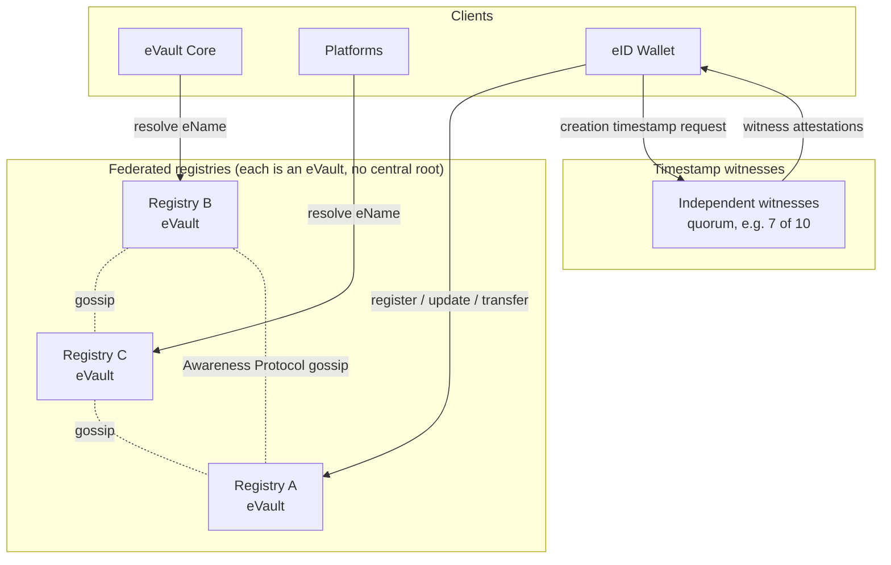

# Decentralised Registry

This section proposes a decentralised replacement for the single centralised
[Registry](/docs/Infrastructure/Registry). It is shaped by two requirement
documents, and is meant to be read against them:

- [W3ID and eName Requirements](https://github.com/w3ds-docs/w3ds-docs/wiki/W3ID-eName-Requirements)
- [W3DS Registry Requirements v2](https://github.com/w3ds-docs/w3ds-docs/wiki/W3DS-Registry-Requirements-v2)

> **In plain terms**
>
> The Registry's job is to answer one question about any user: where is their
> [eVault](/docs/Infrastructure/eVault) right now. A client supplies an eName
> and gets back the current address. Today one organisation runs this service
> on its own infrastructure. If that organisation's servers fail, if it alters
> an entry, or if it refuses to answer a lookup, every user and platform is
> affected at once. Decentralised means the same service is run by many
> independent organisations at the same time, so no single one of them can
> break it, alter an entry, or block a lookup on its own.

## Background

The current Registry is one service that every client trusts. Requirement
`NFR1` defines its core role plainly: it is a resolver that maps a global
W3ID or eName to the current eVault location. That single job is the focus of
this design.

Two things that earlier versions of the Registry did are explicitly **not**
registry functions any more:

> **Note on entropy and key binding**
>
> The previous `GET /entropy` endpoint is out of scope. Provisioning flows
> that needed entropy generate it locally in the
> [eID Wallet](/docs/Infrastructure/eID-Wallet) instead.
>
> Key binding, the act of vouching that a public key belongs to an identity,
> is also out of registry scope. Requirements `NFR3` and `NFR13` are explicit:
> the registry is not the source of truth for user keys or identity, and the
> [eVault](/docs/Infrastructure/eVault) is the source of truth for its own
> certificates. Key binding certificates therefore live in the eVault, with
> attestation moving to the future Remote Notary. The registry only resolves
> locations.

A single Registry is a [single point of failure](https://en.wikipedia.org/wiki/Single_point_of_failure),
a single point of trust, and a single point of censorship. One operator can
withhold a resolution, alter an entry, or disappear and break every eName at
once. That contradicts the decentralised goals of W3DS.

## Design goals

The requirement documents pin down the model. The design must satisfy all of
the following.

- **Persistent resolution.** A W3ID is a long-lived identifier, designed to
  stay stable for the lifetime of the entity and across key rotation and
  eVault migration (W3ID Sections 4 and 7).
- **Federated peers, no central root.** Registries must operate as peers, with
  no mandatory central root registry (`NFR10`), and a new or low-reputation
  registry must not be able to override established records by assertion alone
  (`NFR11`).
- **Eventual consistency.** Registries must assume
  [eventual consistency](https://en.wikipedia.org/wiki/Eventual_consistency)
  and tolerate temporarily incomplete knowledge of their peers (`NFR4`,
  `NFR5`).
- **Conflicts detected, never hidden.** Duplicate or contradictory records are
  expected. A registry must detect them and must not silently overwrite or
  silently resolve them (`FR9`, `FR21`, `FR23`).
- **Auditable history.** Every registry must keep an append-only, tamper
  evident record of how each entry reached its current state (`FR37`, `FR38`).

## The headline idea

Each registry is itself an [eVault](/docs/Infrastructure/eVault). Registries
talk to each other by writing gossip messages into each other's eVaults, and
those messages are delivered by the existing
[Awareness Protocol](/docs/W3DS%20Protocol/Awareness-Protocol). Almost no new
machinery is introduced: storage, audit, and peer delivery are all primitives
W3DS already has.

> **In plain terms**
>
> An eVault is a small data store that already knows how to keep signed
> records, list every change it ever made, and notify subscribers when
> something changes. A registry is just an eVault with a particular job:
> instead of storing one user's posts and contacts, it stores the resolution
> records for many users. Other registries subscribe to its notifications, so
> a change made on one registry shows up on the others within seconds. There
> is no master copy, no special transport, no new protocol.

The one wrinkle is that a registry's own eVault **has no eName**. The reason
is circular: the registry is what dereferences eNames, so the registry's own
eVault cannot be looked up by an eName without depending on itself. It still
has an eVault W3ID for internal identification (W3ID Section 6), and clients
find a registry by a published seed URL rather than by resolution.

## The federated model

Continue to [Architecture](architecture).

## References

- [W3ID and eName Requirements](https://github.com/w3ds-docs/w3ds-docs/wiki/W3ID-eName-Requirements)
- [W3DS Registry Requirements v2](https://github.com/w3ds-docs/w3ds-docs/wiki/W3DS-Registry-Requirements-v2)
- [Registry](/docs/Infrastructure/Registry) for the current centralised design.
- [W3ID](/docs/W3DS%20Basics/W3ID) for identifier format, the ID log, key
  rotation, and migration.
- [eVault](/docs/Infrastructure/eVault) for the storage and webhook primitives
  reused here.
- [Awareness Protocol](/docs/W3DS%20Protocol/Awareness-Protocol) for the
  webhook delivery mechanism used for gossip.
- [Ontology](/docs/Infrastructure/Ontology) for how the gossip message schemas
  are published.
