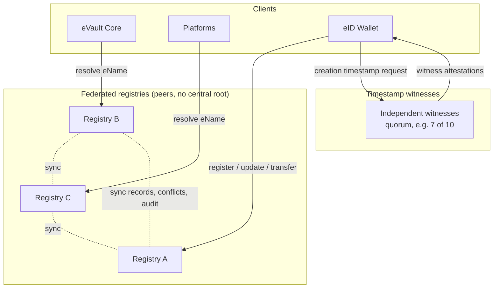

# Decentralised Registry

This section proposes two candidate architectures for replacing the single
centralised [Registry](/docs/Infrastructure/Registry) with a decentralised
design, and compares them in concrete protocol terms.

Both designs are shaped by two requirement documents, and this section is meant
to be read against them:

- [W3ID and eName Requirements](https://github.com/w3ds-docs/w3ds-docs/wiki/W3ID-eName-Requirements)
- [W3DS Registry Requirements v2](https://github.com/w3ds-docs/w3ds-docs/wiki/W3DS-Registry-Requirements-v2)

> **In plain terms**
>
> The Registry's job is to answer one question about any user: where is their
> [eVault](/docs/Infrastructure/eVault) right now. A client supplies an eName
> and gets back the current address. Today one organisation runs this service
> on its own infrastructure. If that organisation's servers fail, if it alters
> an entry, or if it refuses to answer a lookup, every user and platform is
> affected at once. Decentralised means the same service is run by many
> independent organisations at the same time, so no single one of them can
> break it, alter an entry, or block a lookup on its own.

It is split across five pages:

1. **Overview** (this page): the problem, design goals, the shared eName
   record, and the rules for conflicts, transfers, and audit that both
   solutions obey.
2. [Solution 1: Federated DHT](federated-dht): peer registries that
   replicate records to each other, with worked examples.
3. [Solution 2: Ledger-anchored](ledger-anchored): peer registries that each
   publish an append-only, auditable log, with worked examples.
4. [Comparison and migration](comparison): a side-by-side comparison and a
   staged rollout plan.
5. [Requirements coverage](requirements-coverage): a matrix mapping every
   requirement to where it is satisfied.

## Background

The current Registry is one service that every client trusts. Requirement
`NFR1` defines its core role plainly: it is a resolver that maps a global
W3ID or eName to the current eVault location. That single job is the focus of
both designs below.

Two things that earlier versions of the Registry did are explicitly **not**
registry functions any more:

> **Note on entropy and key binding**
>
> The previous `GET /entropy` endpoint is out of scope. Provisioning flows
> that needed entropy generate it locally in the
> [eID Wallet](/docs/Infrastructure/eID-Wallet) instead.
>
> Key binding, the act of vouching that a public key belongs to an identity,
> is also out of registry scope. Requirements `NFR3` and `NFR13` are explicit:
> the registry is not the source of truth for user keys or identity, and the
> [eVault](/docs/Infrastructure/eVault) is the source of truth for its own
> certificates. Key binding certificates therefore live in the eVault, with
> attestation moving to the future Remote Notary. The registry only resolves
> locations.

A single Registry is a [single point of failure](https://en.wikipedia.org/wiki/Single_point_of_failure),
a single point of trust, and a single point of censorship. One operator can
withhold a resolution, alter an entry, or disappear and break every eName at
once. That contradicts the decentralised goals of W3DS.

## Design goals

The requirement documents do not just ask for decentralisation in the abstract,
they pin down the model. Any solution must satisfy all of the following.

- **Persistent resolution.** A W3ID is a long-lived identifier, designed to
  stay stable for the lifetime of the entity and across key rotation and eVault
  migration (W3ID Sections 4 and 7). Resolution must keep working across all of
  those events.
- **Federated peers, no central root.** Registries must operate as peers, with
  no mandatory central root registry (`NFR10`), and a new or low-reputation
  registry must not be able to override established records by assertion alone
  (`NFR11`).
- **Eventual consistency.** Registries must assume
  [eventual consistency](https://en.wikipedia.org/wiki/Eventual_consistency)
  and tolerate temporarily incomplete knowledge of their peers (`NFR4`,
  `NFR5`).
- **Conflicts detected, never hidden.** Duplicate or contradictory records are
  expected. A registry must detect them and must not silently overwrite or
  silently resolve them (`FR9`, `FR21`, `FR23`).
- **Auditable history.** Every registry must keep an append-only, tamper
  evident record of how each entry reached its current state (`FR37`, `FR38`).

Both designs are federations of peer registries. They differ in **how each
registry stores its records and proves their integrity**, which is what the two
solution pages explore.

## The federated model



## The shared eName record

Both solutions store the same logical object, the **eName record**. The schema
below is reused by both designs.

```json
{
  "ename": "@e4d909c2-5d2f-4a7d-9473-b34b6c0f1a5a",
  "class": "global",
  "controller": "@e4d909c2-5d2f-4a7d-9473-b34b6c0f1a5a",
  "evault": "@b1c2d3e4-7f80-4a11-9c22-d3e4f5061728",
  "uri": "https://evault.example.com/users/user-a",
  "version": 3,
  "creationRecord": {
    "creationTimestamp": 1737730800,
    "genesisKey": "zGenesisPublicKey...",
    "timestampProof": {
      "policy": "7-of-10",
      "witnesses": [
        { "witness": "witness-01", "attestedAt": 1737730805, "signature": "z..." },
        { "witness": "witness-04", "attestedAt": 1737730802, "signature": "z..." }
      ]
    },
    "proof": { "type": "ecdsa-2019", "signature": "zGenesisSelfSignature..." }
  },
  "transferChain": [],
  "controlKey": "zCurrentControlKey...",
  "conflictStatus": "none",
  "updatedAt": 1737900000,
  "proof": {
    "type": "ecdsa-2019",
    "verificationMethod": "@e4d909c2-...#control-key-2",
    "signature": "zSignatureByPreviousControlKey..."
  }
}
```

What the fields mean:

- `ename`, `class`, `controller`, `evault`, `uri`: the resolution result. The
  `controller` eName identifies the person, group, or device, and is kept
  distinct from the `evault` W3ID, which identifies one eVault instance (W3ID
  Section 6). `class` is `global` or `local` (W3ID Section 3).
- `creationRecord`: the genesis of the eName. It is written once and **never
  overwritten** (`FR30`). It carries the `creationTimestamp`, a `genesisKey`,
  and a `timestampProof`.
- `transferChain`: an ordered list of transfer records, empty until the eName
  first moves eVault. See [Transfer records](#transfer-records).
- `controlKey`: the key currently allowed to authorise updates to this record.
  Rotating it is itself a signed update. This is internal registry
  authorisation only, separate from user key binding, which is out of scope.
- `conflictStatus`: `none`, `conflict_pending_review`, or `resolved`.
- `version`, `updatedAt`, `proof`: the current state and the owner signature
  over it.

### Creation timestamps and witnesses

Every creation record must carry a `creationTimestamp`, and that timestamp
should be backed by a `timestampProof` from several independent witnesses
(W3ID Section 9, `FR16` to `FR19`).

> **In plain terms**
>
> When an eName is first created, the time of creation matters, because if two
> records ever claim the same eName the older one wins. A single clock could be
> wrong or be lied about, so the creation time is attested by a set of
> independent witnesses. A record is well-supported when enough of them agree,
> for example 7 of 10. A record with no such proof is still accepted, but it is
> trusted less than one that has it (`NFR8`).

The witnesses are independent timestamping services. The owner asks several of
them to attest the creation, collects their signed attestations, and stores the
quorum in `timestampProof`. When comparing two records, registries use a
deterministic policy such as the median of the valid attestations (`NFR7`).

### Updates and key rotation

An update is a new `version` of the record, signed by the previous version's
`controlKey`. Rotating the control key is an ordinary update: the new record
carries the new key and is signed by the old one. This keeps an unbroken chain
of authority from the genesis record forward, and means a W3ID survives key
rotation without changing (W3ID Section 5).

Because every record and every update is self-signed, a registry cannot forge
or silently rewrite an entry. It can only choose whether to serve it, and the
rules below constrain even that.

## Transfer records

Moving an eName from one eVault to another is **not** a plain overwrite of the
target (`FR26`, `FR27`). It is a signed **transfer record** appended to
`transferChain` (W3ID Section 10, `FR26` to `FR31`).

```json
{
  "previousTarget": "@b1c2d3e4-7f80-4a11-9c22-d3e4f5061728",
  "newTarget": "@f9a8b7c6-1234-4def-8a9b-0c1d2e3f4051",
  "effectiveTime": 1738500000,
  "creationReference": "hash-of-the-creation-record",
  "documentHash": "hash-of-the-transfer-document",
  "authorizationEvidence": ["signature-by-controller", "evidence-..."],
  "signatures": ["zSignedByPreviousController..."]
}
```

A registry accepts a new target for an eName **only** when a valid transfer
chain links it back to the preserved creation record (`FR29`, `FR31`,
W3ID Section 10). The genesis record stays in place; the chain is appended, not
replaced.

## Conflict detection and resolution

The requirements assume that duplicate and contradictory records will happen,
whether by accident or by attack, and they make handling conflicts a first
class registry duty.

> **In plain terms**
>
> A conflict is when the same eName points at two different eVaults and there
> is no valid transfer explaining the change. A registry must never just pick
> one quietly. It flags the entry, tells its peers and its clients, and follows
> a fixed rule to decide a winner: the record with the oldest properly
> witnessed creation timestamp. If the timestamps are too close or the evidence
> is too thin to be sure, the entry is left marked for review rather than
> guessed.

The rules, drawn directly from the requirements:

- A conflict exists when the same global W3ID or eName maps to different
  targets with no valid transfer chain (`FR20`).
- A registry must detect and record conflicts, and must expose conflict state
  to peers and clients (`FR21`, `FR22`). Resolution responses carry that state
  (`FR8`), and even cached answers must preserve it (`FR10`).
- A registry must not silently return a conflicting record as normal (`FR9`),
  and must not resolve a conflict unless its policy can pick a clear winner
  (`FR23`).
- The default winner is the record with the oldest valid creation timestamp
  (`FR24`), compared with a deterministic policy (`NFR7`).
- If timestamps are too close or evidence is insufficient, the record is marked
  `conflict_pending_review` (`FR25`).
- Resolution considers more than timestamps: first-seen evidence from trusted
  peers, source reputation, transfer documents, and audit logs all feed in
  (`NFR9`).

## Audit log, peer sync, and reputation

Every registry, in either design, keeps an **append-only, tamper-evident audit
log** of every event that changes a record: creation, update, target change,
transfer acceptance, conflict detection, conflict resolution, peer
synchronisation, and source-reputation change (`FR37`). Each entry records the
event type, timestamp, previous and new value, source, evidence hashes, and a
registry signature or log-integrity proof (`FR38`).

Registries **synchronise as peers**: they exchange records, conflicts, and
audit metadata (`FR3`, `FR32`), and revise a record's status when a peer
reveals an older valid record (`FR35`). Each registry maintains a **reputation
score** for its peers and for providers (`FR33`). Records from low-reputation
or unknown registries can be marked low trust (`FR34`), and a fake or new
registry cannot override older, higher-reputation records by assertion alone
(`NFR11`, `NFR16`, `NFR17`).

The two solutions implement this audit log differently, and that difference is
the heart of the comparison. Continue to
[Solution 1: Federated DHT](federated-dht).

## References

- [W3ID and eName Requirements](https://github.com/w3ds-docs/w3ds-docs/wiki/W3ID-eName-Requirements)
- [W3DS Registry Requirements v2](https://github.com/w3ds-docs/w3ds-docs/wiki/W3DS-Registry-Requirements-v2)
- [Registry](/docs/Infrastructure/Registry) for the current centralised design.
- [W3ID](/docs/W3DS%20Basics/W3ID) for identifier format, the ID log, key
  rotation, and migration.
- [eVault](/docs/Infrastructure/eVault) for how resolution is consumed in
  access control and webhook delivery, and where key binding now lives.
