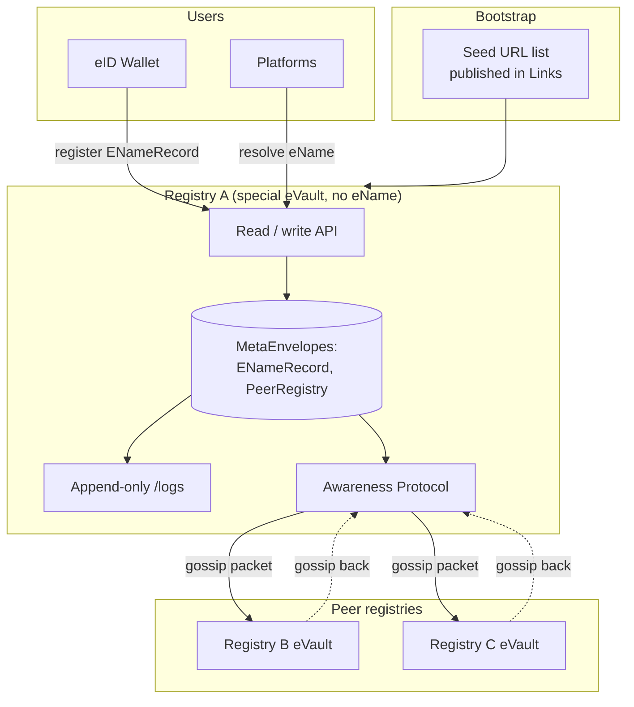

# Architecture

This page describes the structural design: what a registry is built from, the
shape of an eName record, how audit history is kept, and how registries find
each other. For the problem statement and design goals see the
[Overview](../). For how registries actually exchange records, continue to
[Gossip protocol](../gossip-protocol).

## A registry is a special eVault

A registry is the standard [eVault](/docs/Infrastructure/eVault) you already
know from the prototype docs, with a specific role and three small
differences. Everything else carries over: MetaEnvelopes, Envelopes, the
read/write API, ACLs, the append-only `/logs` endpoint, and the
[Awareness Protocol](/docs/W3DS%20Protocol/Awareness-Protocol) for change
notifications.

> **In plain terms**
>
> An eVault is a small data store that knows how to keep signed records, list
> every change it ever made, and notify subscribers when something changes. A
> registry is one of these eVaults, configured to store one specific kind of
> record (eName resolution records) and to talk to other registries instead of
> to user-facing platforms. By starting from a primitive that already exists,
> the design avoids inventing a new storage layer, a new audit log, and a new
> peer transport.

The three differences from a user eVault:

- **No eName.** Every eVault has an internal eVault W3ID (W3ID Section 6).
  User eVaults are also registered for global eName resolution; a registry
  eVault is not, because dereferencing eNames is the registry's own job and
  doing so would be circular. The registry is found by URL from a published
  seed list instead.
- **Bootstrap by seed list, not by resolution.** A new registry contacts one
  or more **seed registry URLs** published in
  [Links](/docs/W3DS%20Basics/Links). From those it learns the rest of the
  federation through ordinary peer exchange (see
  [Gossip protocol](../gossip-protocol)).
- **Public read.** eName resolution records use ACL `["*"]`, so any client can
  resolve any eName from any registry. Writes are still owner authorised by
  the record's signature chain, not by a registry-level write permission.

## eName records as MetaEnvelopes

An eName record is a MetaEnvelope stored in the registry's eVault under a new
**`ENameRecord`** ontology schema. The schema is published the same way every
other W3DS schema is, through the [Ontology](/docs/Infrastructure/Ontology)
service, and gets a `schemaId` W3ID.

```json
{
  "$schema": "http://json-schema.org/draft-07/schema#",
  "schemaId": "a1b2c3d4-1111-2222-3333-444455556666",
  "title": "ENameRecord",
  "type": "object",
  "properties": {
    "ename":            { "type": "string", "description": "Global W3ID" },
    "class":            { "type": "string", "enum": ["global", "local"] },
    "controller":       { "type": "string", "description": "Controller eName" },
    "evault":           { "type": "string", "description": "Current eVault W3ID" },
    "uri":              { "type": "string", "format": "uri" },
    "version":          { "type": "integer", "minimum": 1 },
    "creationRecord":   { "type": "object" },
    "transferChain":    { "type": "array",  "items": { "type": "object" } },
    "controlKey":       { "type": "string" },
    "conflictStatus":   { "type": "string", "enum": ["none", "conflict_pending_review", "resolved"] },
    "updatedAt":        { "type": "integer" },
    "proof":            { "type": "object" }
  },
  "required": ["ename", "class", "controller", "evault", "uri", "version", "creationRecord", "controlKey", "updatedAt", "proof"],
  "additionalProperties": false
}
```

A concrete record:

```json
{
  "ename": "@e4d909c2-5d2f-4a7d-9473-b34b6c0f1a5a",
  "class": "global",
  "controller": "@e4d909c2-5d2f-4a7d-9473-b34b6c0f1a5a",
  "evault": "@b1c2d3e4-7f80-4a11-9c22-d3e4f5061728",
  "uri": "https://evault.example.com/users/user-a",
  "version": 3,
  "creationRecord": {
    "creationTimestamp": 1737730800,
    "genesisKey": "zGenesisPublicKey...",
    "timestampProof": {
      "policy": "7-of-10",
      "witnesses": [
        { "witness": "witness-01", "attestedAt": 1737730805, "signature": "z..." },
        { "witness": "witness-04", "attestedAt": 1737730802, "signature": "z..." }
      ]
    },
    "proof": { "type": "ecdsa-2019", "signature": "zGenesisSelfSignature..." }
  },
  "transferChain": [],
  "controlKey": "zCurrentControlKey...",
  "conflictStatus": "none",
  "updatedAt": 1737900000,
  "proof": {
    "type": "ecdsa-2019",
    "verificationMethod": "@e4d909c2-...#control-key-2",
    "signature": "zSignatureByPreviousControlKey..."
  }
}
```

What the fields mean:

- `ename`, `class`, `controller`, `evault`, `uri`: the resolution result. The
  `controller` eName identifies the person, group, or device, and is kept
  distinct from the `evault` W3ID, which identifies one eVault instance (W3ID
  Section 6). `class` is `global` or `local` (W3ID Section 3).
- `creationRecord`: the genesis of the eName. Written once and **never
  overwritten** (`FR30`). Carries the `creationTimestamp`, a `genesisKey`, and
  a `timestampProof` from a quorum of independent witnesses (W3ID Section 9,
  `FR16` to `FR19`).
- `transferChain`: an ordered list of signed transfer records, empty until the
  eName first moves eVault (W3ID Section 10, `FR26` to `FR31`).
- `controlKey`: the key currently allowed to authorise updates to this record.
  Rotating it is itself a signed update. This is internal registry
  authorisation only, separate from user key binding.
- `conflictStatus`: `none`, `conflict_pending_review`, or `resolved`
  (`FR8`, `FR25`).
- `version`, `updatedAt`, `proof`: the current state and the owner signature
  over it. An update is only accepted if its `version` is exactly one greater
  than the current one and its `proof` verifies against the previous version's
  `controlKey`.

Updates and key rotation are ordinary version-bumped MetaEnvelope updates.
The eName is never changed by either (W3ID Section 5).

## Audit history through the eVault `/logs`

The eVault already exposes a paginated, append-only log of every envelope
operation (create, update, delete) with `eName`, `metaEnvelopeId`,
`envelopeHash`, `operation`, `platform`, `timestamp`, and `ontology` per entry.
See the [eVault `/logs` documentation](/docs/Infrastructure/eVault#logs).

Mapping that log directly satisfies the registry audit requirements:

- Every eName record change is a MetaEnvelope write, so it is logged.
- Conflict detections, conflict resolutions, and reputation changes are also
  written as MetaEnvelopes (under separate ontologies described in
  [Gossip protocol](../gossip-protocol)), so they are logged too.
- The log entry already carries everything `FR38` asks for: type, timestamp,
  previous and new value (via `envelopeHash`), source (`platform`), evidence
  reference, and is served by an eVault whose responses are signed by the
  registry. No new audit machinery is needed.

## Peer list as a MetaEnvelope

The set of peer registries a given registry knows about is stored in its own
eVault as MetaEnvelopes under a **`PeerRegistry`** ontology:

```json
{
  "peerEVault": "@registry-b-evault-w3id",
  "url": "https://registry-b.w3ds.example",
  "reputation": 0.92,
  "lastSeen": 1737900000
}
```

Peer entries are themselves gossiped (see
[Gossip protocol](../gossip-protocol)), so the federation discovers itself.
Reputation drives `FR33` and `FR34`: a low score downgrades records sourced
from that peer.

## Topology



## Example A: registering an eName

The eID Wallet collects witness timestamps, builds the v2 record, and submits
it to a registry as a new MetaEnvelope under the `ENameRecord` ontology, with
public ACL `["*"]`. The registry:

1. Validates the record against the `ENameRecord` schema.
2. Checks the witness quorum on `creationRecord.timestampProof` and the
   genesis self-signature.
3. Runs a best-effort duplicate check against its own records (`FR11`,
   `FR12`).
4. Stores the MetaEnvelope.
5. Lets the [Awareness Protocol](/docs/W3DS%20Protocol/Awareness-Protocol)
   fire a notification to every subscribed peer registry (the peer-side flow
   is the subject of the next page).
6. The store operation also lands in the eVault `/logs`, giving the audit
   history for free.

The exact request shape is whatever the production eVault read/write API
turns out to be; what matters here is the conceptual call: "create an
`ENameRecord` MetaEnvelope with this payload."

## Example B: resolving an eName

Resolution is a lookup against the registry's store: find the
`ENameRecord` MetaEnvelope whose `ename` matches the requested W3ID, and
return its current state. A registry that wants a backward-compatible API can
expose a thin `GET /resolve?w3id=...` shim that wraps the lookup, so existing
clients of the current Registry need no change.

The response carries the eName record, including its `conflictStatus`. If the
status is anything other than `none`, the conflict metadata travels with it
(`FR8`, `FR10`).

Continue to [Gossip protocol](../gossip-protocol).
