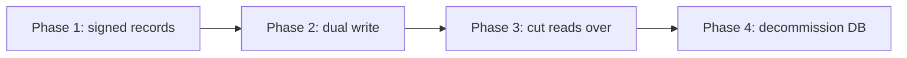

# Comparison and migration

This page compares the two candidate designs and proposes a staged rollout. See
[Solution 1](../federated-dht) and [Solution 2](../ledger-anchored) for the full
descriptions.

> **In plain terms**
>
> The two designs solve the same problem with a different trade-off. In
> Solution 1 the records are copied across many independent servers. It is
> fast, cheap to run, and always available, but two copies can be a few seconds
> out of step after a change. In Solution 2 every change is agreed by a group of
> operators and written into a permanent record that is never altered. It is
> slower to write, but it provides a complete history and removes the need to
> trust any single organisation. In short, Solution 1 favours speed and cost,
> and Solution 2 favours verifiability and accountability. The table below sets
> this out line by line.

## Side-by-side comparison

| Dimension | Solution 1: Federated DHT | Solution 2: Ledger-anchored |
| --- | --- | --- |
| Trust model | Trust a t-of-n quorum of operators | Trust a BFT validator supermajority |
| Resolution latency | Low, occasional DHT hops | Low from a gateway, proof check for light clients |
| Write or finality latency | Fast, gossip propagation | Slower, waits for block finality |
| Consistency model | Eventually consistent | Globally consistent, totally ordered |
| Censorship resistance | Good, any node can serve | Strong, censorship needs a colluding supermajority |
| Auditability | Limited, no global history | Full, append-only block history |
| Key binding | Threshold-signed JWT, group key in JWKS | On-ledger record, no certificate authority |
| Migration and also-known-as | Signed `alsoKnownAs` record gossiped | `MIGRATE` transaction committed on ledger |
| Operational cost | Moderate, run a node and a signer share | Higher, run a validator and store growing history |
| Client cost | Plain HTTP resolve | Plain resolve, or header plus proof for high assurance |
| Main risk | Sybil operators, quorum downtime | Governance capture, storage growth |

## How to choose

- Choose **Solution 1** if the priority is availability, low resolution
  latency, and low operational cost, and an eventually consistent view of eName
  records is acceptable.
- Choose **Solution 2** if the priority is verifiability, a tamper-evident
  audit trail, and removing the certificate authority shortcut, and a slower
  write path is acceptable.

A hybrid is also possible: run the BFT ledger as the source of truth for
writes, and run DHT mirror nodes as a fast eventually-consistent read cache in
front of it. That keeps Solution 2 trust with Solution 1 read latency, at the
cost of running both layers.

## Worked example: the same migration in both designs

A user moves from `evault-001` to `evault-042`. The eName record goes from
`version` 2 to `version` 3 in both designs; only the transport differs.

**Solution 1 (Federated DHT)**

```http
PUT /records/@e4d909c2-... HTTP/1.1
{ "version": 3, "evault": "evault-042", "alsoKnownAs": ["evault-001"], "...": "" }
```

The receiving node verifies `proof` against the `version` 2 key, stores the
record on the `k` closest nodes, and anti-entropy gossip propagates it. Within
seconds most nodes resolve `version` 3; a node still on `version` 2 self-heals
on its next digest exchange.

**Solution 2 (Ledger-anchored)**

```http
POST /tx HTTP/1.1
{ "type": "MIGRATE", "record": { "version": 3, "evault": "evault-042", "...": "" } }
```

The transaction enters the mempool, commits in a block at deterministic
finality, and every full node updates its state index in lockstep. The
migration is permanently visible in block history.

## Recommended migration path

Both solutions keep the existing read API (`GET /resolve`, `GET /list`,
`GET /.well-known/jwks.json`) behind a gateway, so clients do not change on day
one. The point of this section is that this is not a risky big-bang switch:
each phase below is independently useful and reversible, so the project can
stop or roll back at any point without breaking users.



1. **Signed records**: introduce the self-signed, version-chained eName record
   in front of the current database, so writes become owner-authorised before
   any decentralisation. This is valuable on its own and is design independent.
2. **Dual write**: stand up the chosen data layer, the DHT federation or the
   BFT ledger, and have the current Registry write to both it and the legacy
   database.
3. **Cut reads over**: move `GET /resolve` and `GET /list` to read from the new
   layer behind the same gateway endpoints. Clients see no change.
4. **Decommission**: retire the central database and the single signing key
   once the new layer has been stable in production.

At each phase the system stays serviceable, and a rollback only means pointing
the gateway back at the legacy database.

## References

- [Overview](../) for the problem statement and the shared eName record.
- [Solution 1: Federated DHT](../federated-dht).
- [Solution 2: Ledger-anchored](../ledger-anchored).
- [Registry](/docs/Infrastructure/Registry) for the current centralised design.
