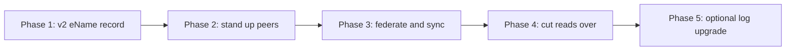

# Comparison and migration

This page compares the two candidate designs and proposes a staged rollout. See
[Solution 1](../federated-dht) and [Solution 2](../ledger-anchored) for the
full descriptions, and the [Overview](../) for the shared record and rules.

> **In plain terms**
>
> Both designs are the same federation of peer registries, with the same eName
> record, the same conflict rules, and the same transfer model. They differ in
> one thing: how each registry proves its history. In Solution 1 you trust a
> registry's answer because it signed it. In Solution 2 you can demand a short
> mathematical proof that the answer is genuine and that the registry never
> rewrote its past. Solution 1 is simpler and faster to build. Solution 2 costs
> more engineering and a little work per lookup, and in return it makes the
> auditability requirements provable rather than merely promised.

## Side-by-side comparison

| Dimension | Solution 1: Federated DHT | Solution 2: Ledger-anchored |
| --- | --- | --- |
| Federation model | Peer registries, no central root | Peer registries, no central root |
| Consistency | Eventually consistent | Eventually consistent |
| Record, conflicts, transfers | Shared model from the Overview | Shared model from the Overview |
| Resolution latency | Lowest, every registry answers locally | Low, plus a small proof to verify |
| How a client trusts an answer | Registry signature | Inclusion proof against a signed log head |
| History rewriting | Caught only by comparing full copies | Caught by a failed consistency proof |
| Audit log (`FR37`) | Per registry, trusted by signature | Per registry, provable by Merkle proof |
| Conflict detection | On gossip and anti-entropy sync | By comparing append-only logs anytime |
| Client cost | Plain HTTP resolve | Resolve plus proof verification |
| Storage | Full copy per registry | Full copy plus log structure |
| Engineering effort | Lower | Higher |
| Main risk | A registry can rewrite its own copy undetected between syncs | Proof machinery adds implementation complexity |

## How to choose

- Choose **Solution 1** if the priority is shipping the federated model quickly
  with the least moving parts, and trusting each registry's signature for its
  own audit history is acceptable for now.
- Choose **Solution 2** if the priority is making the append-only audit
  requirements (`FR37`, `FR38`) verifiable by clients and peers rather than
  trusted, and detecting any registry that rewrites its history.

Because the two designs share the eName record, the conflict rules, and the
transfer model, Solution 1 is a clean stepping stone to Solution 2: the log can
be added to a registry later without changing the record format or the
federation protocol.

## Worked example: the same transfer in both designs

A user moves from eVault `@b1c2...` to eVault `@f9a8...`. In both designs this
is a signed transfer record appended to `transferChain`, never a target
overwrite, with the genesis creation record preserved (`FR26` to `FR31`).

**Solution 1 (Federated DHT)**

```http
PUT /records/@e4d909c2-... HTTP/1.1
{ "version": 3, "evault": "@f9a8b7c6-...", "transferChain": [ { "...": "" } ] }
```

The receiving registry verifies the transfer chain links back to the creation
record, stores the new version, appends a transfer entry to its audit log, and
gossips it. Peers converge within seconds.

**Solution 2 (Ledger-anchored)**

```http
PUT /records/@e4d909c2-... HTTP/1.1
{ "version": 3, "evault": "@f9a8b7c6-...", "transferChain": [ { "...": "" } ] }
```

Identical request. The registry additionally appends the transfer to its Merkle
log and returns an inclusion proof, so the ownership history of the eName
becomes provable, not just asserted.

## Recommended migration path

The current single Registry keeps serving `GET /resolve` and `GET /list` behind
a gateway throughout, so clients do not change on day one. Each phase below is
independently useful and reversible, so this is not a big-bang switch.



1. **v2 eName record.** Introduce the new record format behind the current
   database: creation records with witnessed timestamps, the version and
   control-key chain, transfer records, and the `conflictStatus` field. This is
   valuable on its own and is design independent.
2. **Stand up peers.** Run additional registry instances, operated
   independently, each holding a full copy. Begin best-effort duplicate checks.
3. **Federate and sync.** Turn on peer synchronisation, conflict detection, and
   source reputation. The federation is now live even though the old Registry
   is still authoritative.
4. **Cut reads over.** Move `GET /resolve` and `GET /list` to read from the
   federation behind the same gateway endpoints. Clients see no change.
5. **Optional log upgrade.** If Solution 2 is chosen, add the append-only
   Merkle log to each registry and start serving proofs. The record format and
   federation protocol do not change, so this is purely additive.

Phases 1 to 4 deliver Solution 1. Phase 5 is the only step unique to
Solution 2, which is why the decision between them does not have to be made on
day one.

## References

- [Overview](../) for the problem statement, the shared eName record, and the
  conflict, transfer, and audit rules.
- [Solution 1: Federated DHT](../federated-dht).
- [Solution 2: Ledger-anchored](../ledger-anchored).
- [Requirements coverage](../requirements-coverage) for the full requirement
  matrix.
- [Registry](/docs/Infrastructure/Registry) for the current centralised design.
