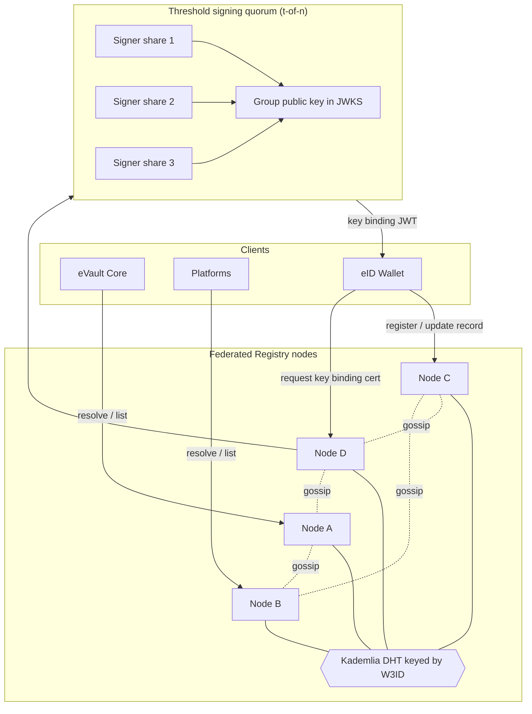
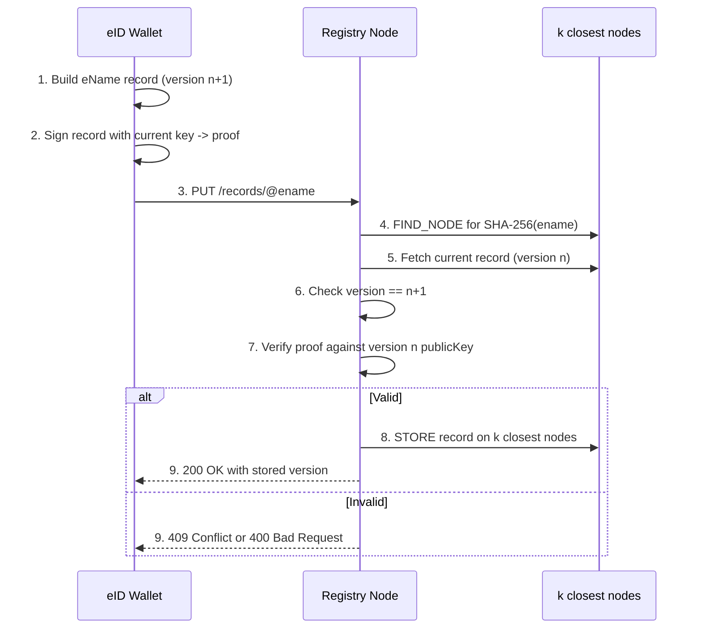
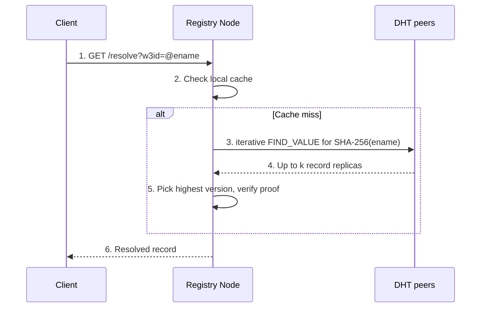

# Solution 1: Federated registry nodes over a DHT

This page describes the first candidate design and walks through worked
examples. For the shared eName record and design goals, see the
[Overview](../).

## Summary

A set of independently operated Registry nodes each run the same public API.
eName records are stored in a
[distributed hash table](https://en.wikipedia.org/wiki/Distributed_hash_table)
(DHT) keyed by the W3ID, so any node can resolve any eName regardless of which
node first received the write. Writes are self-signed by the eName owner and
spread between nodes by a [gossip protocol](https://en.wikipedia.org/wiki/Gossip_protocol).
Key binding certificates are issued by a threshold-signing quorum so that no
single node can forge a certificate.

> **In plain terms**
>
> The records are spread across many servers run by different organisations. No
> single server holds all of them. Each server holds a share, and they all
> follow the same rule for deciding which server is responsible for which
> records, so any server can still answer any lookup. A distributed hash table
> is that rule, implemented in software. If some servers go offline, the
> remaining ones still hold the data. No single organisation controls the whole
> set, so none of them can shut it down or alter it unnoticed.

## Topology



## Node membership and bootstrapping

The specific rule used here is [Kademlia](https://en.wikipedia.org/wiki/Kademlia),
a well-tested design. What matters in plain terms is that it lets any server
find the few other servers responsible for a given record in a small number of
steps, and no one has to keep a central master list of who holds what.

- A new server joins by contacting one or more existing **seed nodes** whose
  addresses are published in [Links](/docs/W3DS%20Basics/Links). It discovers
  the rest of the network by asking those seeds, and asking the servers they
  point to, until it has built up its own view of the network.
- Membership is **permissioned at the federation layer**. Each operator holds
  an operator key, and the current operator set is itself a well-known record
  in the DHT, signed by a t-of-n quorum of existing operators. Admitting a new
  operator is a quorum action. This gives resistance to a
  [Sybil attack](https://en.wikipedia.org/wiki/Sybil_attack), where one party
  creates many fake identities to outvote everyone else: fake nodes can store
  data but cannot vote, because voting requires an admitted operator key.
- Read-only mirror nodes may join without admission. They serve resolutions but
  cannot vote in the signing quorum or admit operators.

## Data placement and replication

The plain-terms goal here is "never keep only one copy of anything".

- The DHT key for an eName is `SHA-256(ename)`, a
  [hash](https://en.wikipedia.org/wiki/Cryptographic_hash_function) that turns
  the name into a fixed fingerprint used to decide which nodes are responsible
  for it. The record is stored on the `k` closest nodes to that fingerprint,
  where `k` is the replication factor, for example 8. So every entry lives on
  about eight independent machines, not one.
- On write, the receiving node copies the record to all `k` of those nodes.
- Records are also kept in sync by **anti-entropy gossip**: nodes regularly
  compare compact summaries of what they hold, built with a
  [Merkle tree](https://en.wikipedia.org/wiki/Merkle_tree), and pull anything
  they are missing or that is out of date. This is the self-healing mechanism:
  if a node was offline during a write, it catches up automatically the next
  time it compares notes with a neighbour.

## Write path: register, update, migrate



## Example A: registering a new eName

A new user provisions in the eID Wallet. The wallet builds a `version` 1 record
and submits it to any node.

```http
PUT /records/@e4d909c2-5d2f-4a7d-9473-b34b6c0f1a5a HTTP/1.1
Host: node-a.registry.w3ds.example
Content-Type: application/json

{
  "ename": "@e4d909c2-5d2f-4a7d-9473-b34b6c0f1a5a",
  "version": 1,
  "uri": "https://evault.example.com/users/user-a",
  "evault": "evault-001",
  "alsoKnownAs": [],
  "keyBinding": {
    "publicKey": "zDnaerx9Cp5X2chPZ8n3wK7mN9pQrS7tUvW1...",
    "alg": "ES256",
    "rotatedAt": 1737730800
  },
  "updatedAt": 1737730800,
  "proof": {
    "type": "ecdsa-2019",
    "created": 1737730800,
    "verificationMethod": "@e4d909c2-...#key-1",
    "signature": "z3FXQj..."
  }
}
```

The node confirms the eName is syntactically valid and unused, verifies `proof`
against the genesis key declared in `keyBinding`, then issues a `STORE` to the
`k` closest nodes.

```http
HTTP/1.1 200 OK
Content-Type: application/json

{ "ename": "@e4d909c2-...", "version": 1, "storedReplicas": 8 }
```

## Example B: resolving an eName



A platform resolves a user before verifying a signature:

```http
GET /resolve?w3id=@e4d909c2-5d2f-4a7d-9473-b34b6c0f1a5a HTTP/1.1
Host: node-b.registry.w3ds.example
```

```http
HTTP/1.1 200 OK
Content-Type: application/json

{
  "ename": "@e4d909c2-5d2f-4a7d-9473-b34b6c0f1a5a",
  "uri": "https://evault.example.com/users/user-a",
  "evault": "evault-001",
  "originalUri": "https://evault.example.com/users/user-a",
  "resolved": true
}
```

The node returns the highest `version` found among the `k` replicas and
verifies its `proof` before responding. If replicas disagree on `version`, the
highest valid one wins and the node issues a background `STORE` to repair the
stale replicas, which is read repair.

## Example C: key rotation after a lost device

The user lost a phone and rotates keys from a recovery device. The wallet reads
the current record (`version` 1), builds `version` 2 with the new public key,
and signs `proof` with the **old** key.

```http
PUT /records/@e4d909c2-5d2f-4a7d-9473-b34b6c0f1a5a HTTP/1.1
Content-Type: application/json

{
  "ename": "@e4d909c2-5d2f-4a7d-9473-b34b6c0f1a5a",
  "version": 2,
  "uri": "https://evault.example.com/users/user-a",
  "evault": "evault-001",
  "alsoKnownAs": [],
  "keyBinding": {
    "publicKey": "zNEWkeyMaterialForTheRecoveredDevice...",
    "alg": "ES256",
    "rotatedAt": 1737900000
  },
  "updatedAt": 1737900000,
  "proof": {
    "type": "ecdsa-2019",
    "verificationMethod": "@e4d909c2-...#key-1",
    "signature": "z9rotationSignedByOldKey..."
  }
}
```

The node verifies `version` is `n+1` and that `proof` validates against the
`version` 1 public key, then stores it. A node that receives a forged
`version` 2 signed by an attacker key fails step 7 and returns `409`.

## Example D: migrating to a new eVault

Migration is an ordinary `version` bump that changes `uri` and `evault` and
appends the old eVault identifier to `alsoKnownAs`. Resolvers that still hold
the old eVault identifier follow `alsoKnownAs` to the new endpoint.

```json
{
  "ename": "@e4d909c2-5d2f-4a7d-9473-b34b6c0f1a5a",
  "version": 3,
  "uri": "https://evault-cloud.example.org/u/user-a",
  "evault": "evault-042",
  "alsoKnownAs": ["evault-001"],
  "...": "proof signed by version 2 key"
}
```

## Example E: issuing a key binding certificate

> **In plain terms**
>
> A key binding certificate is a signed statement that a particular key belongs
> to a particular identity. In the current system one organisation signs every
> such statement, which means that one organisation could also forge one. Here
> the signing key is divided into shares held by several operators, a technique
> called [threshold cryptography](https://en.wikipedia.org/wiki/Threshold_cryptosystem).
> No operator holds the whole key. A statement is only valid once enough of
> them, for example three out of five, have each applied their share. The
> result is a single signature that anyone can check, but producing a fake one
> now requires compromising several independent operators at the same time
> rather than just one.

Key binding stays a [JWT](https://en.wikipedia.org/wiki/JSON_Web_Token) so
existing verifiers in [Signing](/docs/W3DS%20Protocol/Signing) keep working,
but the signing key is split:

- The federation runs a **t-of-n threshold signing scheme** such as FROST over
  P-256. Each operator holds one key share. No node ever holds the full private
  key.
- To issue a certificate, a node collects partial signatures from at least `t`
  operators over the payload (`ename`, `publicKey`, `iat`, `exp`). The combined
  signature verifies against a single **group public key**.
- `GET /.well-known/jwks.json` publishes that group public key. Verifiers do
  not know the signature came from a quorum.

```http
POST /key-binding HTTP/1.1
Content-Type: application/json

{ "ename": "@e4d909c2-...", "publicKey": "zDnaerx9Cp5X2chPZ8n3..." }
```

```http
HTTP/1.1 200 OK
Content-Type: application/json

{ "certificate": "eyJhbGciOiJFUzI1NiIsImtpZCI6Imdyb3VwIn0..." }
```

Before contributing a partial signature, each operator independently re-checks
that `publicKey` matches the current eName record in the DHT. A single
dishonest operator cannot get a forged binding signed because it cannot reach
the threshold `t` alone.

## Security model and failure modes

- **Forgery**: prevented by record self-signatures and threshold signing.
  Compromising fewer than `t` operators yields nothing.
- **Withholding**: a node can refuse to serve, but clients retry other nodes,
  and `k`-way replication plus anti-entropy means the record still exists
  elsewhere. Total withholding needs control of all `k` closest nodes.
- **Sybil**: mitigated by permissioned operator admission; mirror nodes cannot
  vote or sign.
- **Stale reads**: possible during network splits because the system is
  [eventually consistent](https://en.wikipedia.org/wiki/Eventual_consistency),
  meaning a just-made change can take a short while to reach every node. The
  `version` counter bounds the damage: a client can reject an older record if
  it has already seen a newer one.
- **Quorum downtime**: if fewer than `t` operators are online, resolution still
  works but new key binding certificates cannot be issued until quorum returns.
- **Eclipse attack**: an attacker controlling a victim routing table can hide
  records. Mitigations: diverse seed nodes, ID-based bucket constraints, and
  signed operator-set records.

## Strengths and trade-offs

Strengths: low resolution latency, no global blockchain, free join and leave
for mirror nodes, and certificate signing survives loss of up to `n - t`
operators.

Trade-offs: resolution is eventually consistent so a fresh write may take time
to propagate, DHT lookups can need several hops for cold entries, operator
admission needs governance, and certificate issuance depends on quorum
liveness.

Continue to [Solution 2: Ledger-anchored](../ledger-anchored).
