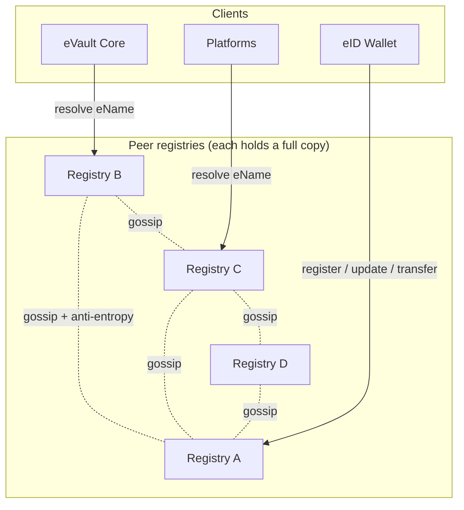
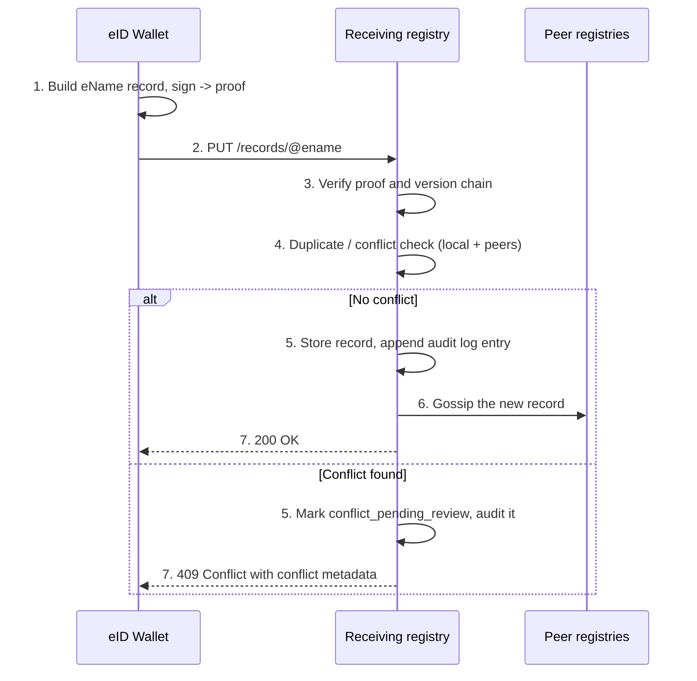
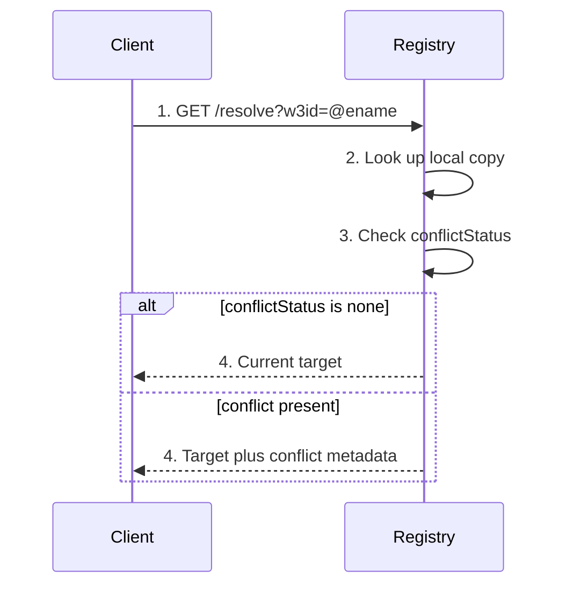
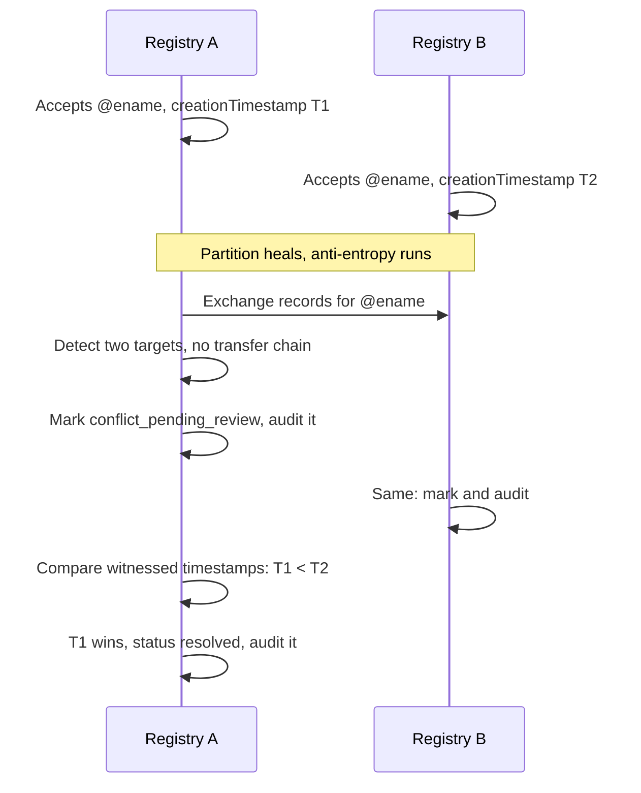

# Solution 1: Federated DHT

This page describes the first candidate design and walks through worked
examples. For the shared eName record, the conflict rules, and the transfer and
audit model, see the [Overview](../).

## Summary

A set of independently operated peer registries each hold a near-complete copy
of all eName records. When one registry accepts a change, it spreads to the
others by a [gossip protocol](https://en.wikipedia.org/wiki/Gossip_protocol):
each registry periodically compares notes with a few peers and pulls anything
it is missing. There is no central root. Any registry can answer any lookup.

> **In plain terms**
>
> Every registry keeps its own full copy of the records. When something
> changes, the registry that received the change tells a few other registries,
> they tell a few more, and within seconds the change has spread to all of
> them. This is the same way news spreads through a group by word of mouth. If
> some registries are offline or slow, the rest still have the data, and the
> stragglers catch up automatically the next time they compare copies. Nobody
> owns the master copy, because there is no master copy.

## Topology



## How records spread

- Each registry stores the full set of eName records locally, so it can resolve
  any eName without contacting a peer.
- After accepting a write, a registry **gossips** the new record to a few
  random peers, who pass it on. Within a few rounds every registry has it.
- In the background, registries run **anti-entropy**: each pair exchanges a
  compact [Merkle-tree](https://en.wikipedia.org/wiki/Merkle_tree) summary of
  what it holds and pulls anything missing or out of date. This is the
  self-healing path that covers a registry that was offline during a gossip
  round.
- A registry that needs to scale beyond a single machine may shard its local
  copy internally, optionally with a
  [distributed hash table](https://en.wikipedia.org/wiki/Distributed_hash_table).
  That is an implementation detail inside one registry and does not change the
  federation model.

## Write path



## Example A: registering a new eName

A new user provisions in the eID Wallet. The wallet first collects timestamp
attestations from several witnesses, then submits the creation record.

```http
PUT /records/@e4d909c2-5d2f-4a7d-9473-b34b6c0f1a5a HTTP/1.1
Host: registry-a.w3ds.example
Content-Type: application/json

{
  "ename": "@e4d909c2-5d2f-4a7d-9473-b34b6c0f1a5a",
  "class": "global",
  "controller": "@e4d909c2-5d2f-4a7d-9473-b34b6c0f1a5a",
  "evault": "@b1c2d3e4-7f80-4a11-9c22-d3e4f5061728",
  "uri": "https://evault.example.com/users/user-a",
  "version": 1,
  "creationRecord": {
    "creationTimestamp": 1737730800,
    "genesisKey": "zGenesisPublicKey...",
    "timestampProof": {
      "policy": "7-of-10",
      "witnesses": [
        { "witness": "witness-01", "attestedAt": 1737730805, "signature": "z..." },
        { "witness": "witness-04", "attestedAt": 1737730802, "signature": "z..." }
      ]
    },
    "proof": { "type": "ecdsa-2019", "signature": "zGenesisSelfSignature..." }
  },
  "transferChain": [],
  "controlKey": "zGenesisPublicKey...",
  "conflictStatus": "none",
  "updatedAt": 1737730800,
  "proof": { "type": "ecdsa-2019", "signature": "z3FXQj..." }
}
```

The registry verifies the genesis self-signature and the witness quorum, runs a
best-effort duplicate check against its own records and reachable peers
(`FR11`, `FR12`), stores the record, appends a creation entry to its audit log,
and gossips it.

```http
HTTP/1.1 200 OK
Content-Type: application/json

{ "ename": "@e4d909c2-...", "version": 1, "conflictStatus": "none" }
```

## Example B: resolving an eName



```http
GET /resolve?w3id=@e4d909c2-5d2f-4a7d-9473-b34b6c0f1a5a HTTP/1.1
Host: registry-b.w3ds.example
```

```http
HTTP/1.1 200 OK
Content-Type: application/json

{
  "ename": "@e4d909c2-5d2f-4a7d-9473-b34b6c0f1a5a",
  "uri": "https://evault.example.com/users/user-a",
  "evault": "@b1c2d3e4-7f80-4a11-9c22-d3e4f5061728",
  "conflictStatus": "none",
  "resolved": true
}
```

Resolution always returns the current accepted target (`FR7`). If the entry is
in conflict, the response also carries the conflict metadata (`FR8`), and a
registry serving a cached answer keeps that conflict status attached (`FR10`).

## Example C: key rotation after a lost device

The user lost a phone and rotates the control key from a recovery device. The
wallet reads `version` 1, builds `version` 2 with the new `controlKey`, and
signs `proof` with the **old** key.

```http
PUT /records/@e4d909c2-5d2f-4a7d-9473-b34b6c0f1a5a HTTP/1.1
Content-Type: application/json

{
  "ename": "@e4d909c2-5d2f-4a7d-9473-b34b6c0f1a5a",
  "version": 2,
  "controlKey": "zNewControlKeyOnRecoveryDevice...",
  "updatedAt": 1737900000,
  "proof": {
    "type": "ecdsa-2019",
    "verificationMethod": "@e4d909c2-...#control-key-1",
    "signature": "zSignedByOldControlKey..."
  },
  "...": "creationRecord and other fields unchanged"
}
```

The registry checks that `version` is one greater and that `proof` verifies
against the `version` 1 control key, stores it, audits the rotation, and
gossips it. The eName itself is unchanged, satisfying the requirement that a
W3ID survives key rotation (W3ID Section 5).

## Example D: transferring to a new eVault

Migration is **not** a plain target overwrite. The wallet appends a signed
transfer record to `transferChain` (`FR26`, `FR27`).

```http
PUT /records/@e4d909c2-5d2f-4a7d-9473-b34b6c0f1a5a HTTP/1.1
Content-Type: application/json

{
  "ename": "@e4d909c2-5d2f-4a7d-9473-b34b6c0f1a5a",
  "version": 3,
  "evault": "@f9a8b7c6-1234-4def-8a9b-0c1d2e3f4051",
  "uri": "https://evault-cloud.example.org/u/user-a",
  "transferChain": [
    {
      "previousTarget": "@b1c2d3e4-7f80-4a11-9c22-d3e4f5061728",
      "newTarget": "@f9a8b7c6-1234-4def-8a9b-0c1d2e3f4051",
      "effectiveTime": 1738500000,
      "creationReference": "hash-of-creation-record",
      "documentHash": "hash-of-transfer-document",
      "authorizationEvidence": ["zSignedByController..."],
      "signatures": ["zSignedByPreviousController..."]
    }
  ],
  "...": "proof signed by version 2 control key"
}
```

A registry accepts the new target only because the transfer chain links it back
to the preserved creation record (`FR29`, `FR31`). The genesis record is never
overwritten (`FR30`), and the transfer is written to the audit log.

## Example E: a conflict and how it is resolved

Two registries are briefly partitioned and each accepts a different genesis
record for the same eName.



Neither registry silently overwrites the other's record (`FR9`). Both mark the
entry `conflict_pending_review` and expose that status (`FR21`, `FR22`,
`FR25`). The deterministic rule then applies: the record with the oldest valid
witnessed creation timestamp wins (`FR24`, `NFR7`). If the two timestamps were
too close to separate, the entry would stay `conflict_pending_review` for human
or policy review. Until a winner is chosen, resolution still returns an answer
but always with the conflict metadata attached.

```http
HTTP/1.1 200 OK
Content-Type: application/json

{
  "ename": "@e4d909c2-...",
  "uri": "https://evault.example.com/users/user-a",
  "conflictStatus": "conflict_pending_review",
  "conflict": {
    "candidates": 2,
    "policy": "oldest-valid-creation-timestamp"
  }
}
```

## Security model and failure modes

- **Forgery**: prevented by the self-signed record and update chain. A registry
  cannot alter a record without breaking a signature.
- **Withholding**: a registry can refuse to serve, but every other registry
  holds a full copy, so a client simply asks another. Total withholding would
  need every registry to collude.
- **Sybil**: a [Sybil attack](https://en.wikipedia.org/wiki/Sybil_attack) tries
  to flood the federation with fake registries. It is blunted by source
  reputation: a fake or unknown registry has too little reputation to override
  established records (`NFR11`, `NFR16`, `NFR17`).
- **Stale reads**: possible during a network split because the system is
  [eventually consistent](https://en.wikipedia.org/wiki/Eventual_consistency).
  The `version` counter and creation timestamps bound the damage, and conflicts
  surface once the split heals.
- **Forged creation race**: an attacker registers a duplicate eName. Because
  peers already hold the older, properly witnessed record, the duplicate loses
  on timestamp once the records meet (`NFR16`).

## Strengths and trade-offs

Strengths: very low resolution latency because every registry answers locally,
a simple client model (a plain HTTP resolve), and a close fit to the federated
peer model the requirements prescribe with no extra machinery.

Trade-offs: every registry stores everything, so storage does not shard across
the federation; the audit log is per registry and is trusted at the strength of
that registry's signature rather than proven to a client; and a client cannot
independently prove that a registry's answer is consistent with its own history
without asking peers. Solution 2 addresses that last point.

Continue to [Solution 2: Ledger-anchored](../ledger-anchored).
