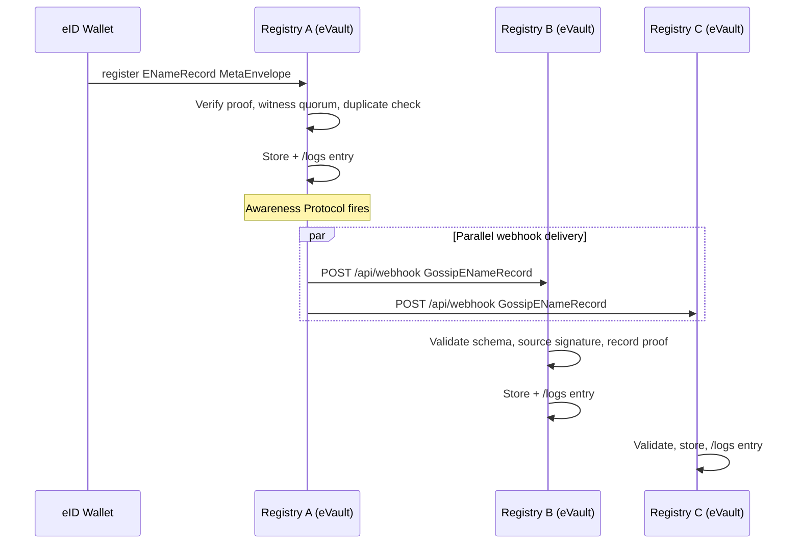
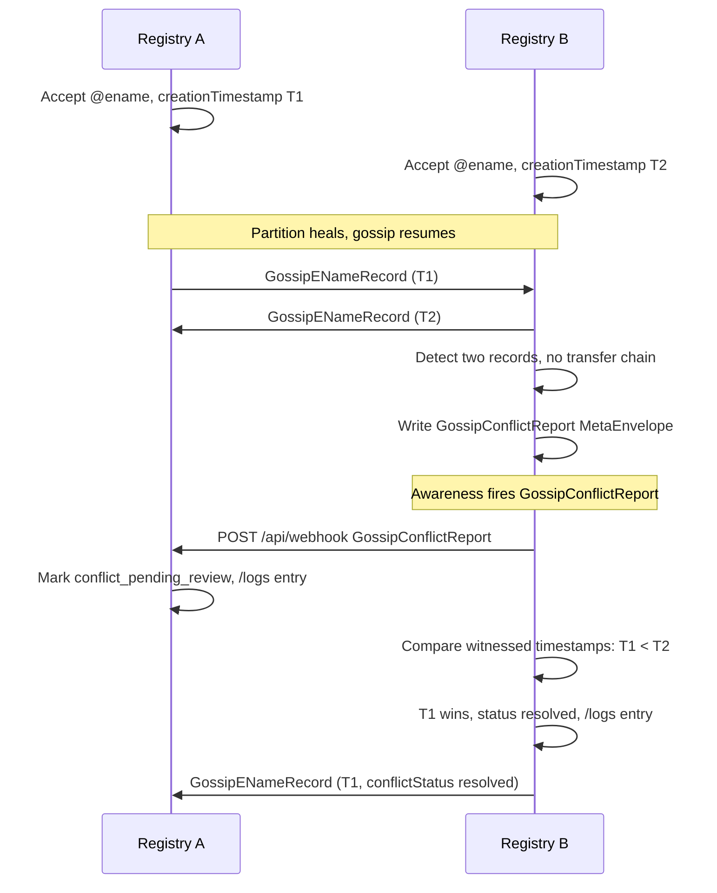

# Gossip protocol

This page describes how registries exchange records with each other. The short
version: they use the existing
[Awareness Protocol](/docs/W3DS%20Protocol/Awareness-Protocol), with a small
new [ontology](/docs/Infrastructure/Ontology) describing the messages they
send. For the architecture each registry is built on, see
[Architecture](../architecture).

## The mechanism in one paragraph

Each registry registers the other registries as subscribers of its eVault, the
same way platforms today subscribe to user eVaults. When a registry accepts a
change, it writes a MetaEnvelope. The eVault's Awareness Protocol delivers
that change to every subscribed registry by sending an HTTP POST to a webhook
endpoint each peer exposes. The receiving registry validates the packet
against the gossip ontology described below, applies the change to its own
state (which is itself a MetaEnvelope write, so it lands in `/logs`), and
forwards anything new to its own subscribers in the next gossip round. There
is no new transport, no new audit log, and no new delivery semantics: gossip
is the Awareness Protocol with a different ontology and a peer registry on
the receiving end.

> **In plain terms**
>
> Every registry already knows how to notify subscribers when its data
> changes. The registries simply subscribe to each other, so a change made on
> one is pushed to all the others within seconds. The notification is a normal
> JSON document that says what changed and why, and the receivers know what to
> do with it because the document follows a published schema.

## The gossip ontology

Each gossip message is a JSON Schema (draft-07) published in the
[Ontology](/docs/Infrastructure/Ontology) service with its own `schemaId`. The
sender places that `schemaId` in the Awareness Protocol packet's `schemaId`
field; the receiver uses it to pick the right validation and application
logic.

| Schema | Sent when | What it carries |
| --- | --- | --- |
| `GossipENameRecord` | A registry accepts a creation or update of an eName record | The full eName record, the source registry ID, the source registry signature |
| `GossipTransfer` | A registry accepts a transfer | The transfer record fields, the new version of the eName record, the source |
| `GossipConflictReport` | A registry detects a conflict between two records for the same eName | References to both records, the comparison evidence, the source |
| `GossipPeerReputation` | A registry updates the reputation of one of its peers | The peer eVault W3ID, the new score, the reason code |
| `GossipPeerList` | Bootstrap or periodic peer exchange | A list of peer eVault W3IDs and URLs the sender knows about |

The first three are the day-to-day flow. The last two keep the federation
discoverable and accountable.

### Example schema: GossipENameRecord

```json
{
  "$schema": "http://json-schema.org/draft-07/schema#",
  "schemaId": "g05519e1-aaaa-bbbb-cccc-000000000001",
  "title": "GossipENameRecord",
  "type": "object",
  "properties": {
    "record":           { "$ref": "ENameRecord" },
    "sourceRegistry":   { "type": "string", "description": "eVault W3ID of the source registry" },
    "sourceSignature":  { "type": "string", "description": "Source registry signature over record + sourceRegistry" },
    "sentAt":           { "type": "integer" }
  },
  "required": ["record", "sourceRegistry", "sourceSignature", "sentAt"],
  "additionalProperties": false
}
```

The other gossip schemas follow the same shape: a typed payload plus
`sourceRegistry`, `sourceSignature`, and `sentAt`. The receiver verifies the
source signature against the source registry's published key, validates the
payload, then applies it.

## How a gossip message rides the Awareness Protocol

The [Awareness Protocol](/docs/W3DS%20Protocol/Awareness-Protocol) packet is:

```json
{
  "id":       "metaEnvelopeId of the change",
  "w3id":     "ownerEName",
  "schemaId": "ontology schemaId",
  "data":     { "...": "payload" }
}
```

For registry-to-registry gossip the fields are filled like this:

- `id`: the MetaEnvelope ID of the eName record (or peer record, or
  reputation record) that changed in the source registry's eVault.
- `w3id`: the **source registry's eVault W3ID**. A registry's eVault has no
  eName (see [Architecture](../architecture#a-registry-is-a-special-evault)),
  so the field carries the internal eVault W3ID instead. This is the only
  deviation from the user-eVault use of this field.
- `schemaId`: one of the gossip ontology schemas above.
- `data`: the gossip payload, validated against that schema.

The standard Awareness Protocol delivery rules (`POST /api/webhook`, 5 second
timeout, fire-and-forget, no retries, parallel delivery, requesting platform
excluded) apply unchanged. Peers receive packets in roughly the same order
they were sent, but ordering across peers is not guaranteed; eventual
consistency is the model, as the requirements expect (`NFR4`).

## Example A: registering and propagating an eName



The peer webhook body:

```json
{
  "id":       "MetaEnvelope-id-on-Registry-A",
  "w3id":     "@registry-a-evault-w3id",
  "schemaId": "g05519e1-aaaa-bbbb-cccc-000000000001",
  "data": {
    "record":          { "ename": "@e4d909c2-...", "version": 1, "...": "" },
    "sourceRegistry":  "@registry-a-evault-w3id",
    "sourceSignature": "zSignedByRegistryA...",
    "sentAt":          1737730801
  }
}
```

Registry B and Registry C each:

1. Validate the packet against the `GossipENameRecord` schema.
2. Verify `sourceSignature` against Registry A's known key.
3. Re-verify the record's own `proof` and `creationRecord.timestampProof`.
4. Run a duplicate / conflict check against their existing records.
5. If clean, store the record as a new `ENameRecord` MetaEnvelope in their
   own eVault. That write itself fires their Awareness Protocol, which is how
   the change reaches anyone subscribed to them.
6. Either way, a `/logs` entry is recorded.

## Example B: resolving from any peer

Because the record has been gossiped to every peer, a client lookup against
any of them succeeds. The resolution flow is the same as in
[Architecture, Example B](../architecture#example-b-resolving-an-ename).
There is nothing special about reads.

## Example C: transfer

Transfer is a `version`-bump update of an eName record whose
`transferChain` gains a new signed entry. The update fires Awareness
Protocol with the `GossipTransfer` schemaId.

```json
{
  "schemaId": "g05519e1-aaaa-bbbb-cccc-000000000002",
  "data": {
    "transfer": {
      "previousTarget":        "@b1c2d3e4-...",
      "newTarget":             "@f9a8b7c6-...",
      "effectiveTime":         1738500000,
      "creationReference":     "hash-of-creation-record",
      "documentHash":          "hash-of-transfer-document",
      "authorizationEvidence": ["zSignedByController..."],
      "signatures":            ["zSignedByPreviousController..."]
    },
    "record":         { "ename": "@e4d909c2-...", "version": 3, "...": "" },
    "sourceRegistry":  "@registry-a-evault-w3id",
    "sourceSignature": "zSignedByRegistryA..."
  }
}
```

Peers accept the new target **only** because the transfer chain links it back
to the preserved `creationRecord` (`FR29`, `FR31`). The genesis is never
overwritten (`FR30`).

## Example D: a conflict and how it is resolved

Two registries are briefly partitioned and each accepts a different genesis
record for the same eName.



Neither registry silently overwrites the other's record (`FR9`). Both mark the
entry `conflict_pending_review` and expose that status to clients (`FR21`,
`FR22`, `FR25`). The deterministic rule then applies: the oldest valid
witnessed creation timestamp wins (`FR24`, `NFR7`). If the two timestamps are
too close to separate, the entry stays `conflict_pending_review` for human or
policy review. Until a winner is chosen, resolution still returns an answer
but always with the conflict metadata attached.

## Example E: peer bootstrap

A new registry starts up with a few seed URLs from
[Links](/docs/W3DS%20Basics/Links). It contacts each, asks for the seed
registry's `PeerRegistry` MetaEnvelopes, validates them, stores its own
`PeerRegistry` records for each peer it learns, and subscribes to those
peers' Awareness Protocols. It then runs an anti-entropy catch-up by paging
through each peer's `ENameRecord` MetaEnvelopes and importing anything it is
missing. After that it participates in
ongoing gossip the same way as everyone else.

## Security and failure modes

- **Forgery**: prevented by the record's own signature chain plus the
  `sourceSignature` on each gossip packet. A peer cannot make Registry A
  appear to have endorsed something it did not sign.
- **Withholding**: a peer can refuse to forward gossip, but every other peer
  is also a subscriber, so a single refusal does not isolate a record.
- **Replay**: the `sentAt` field plus the receiving registry's own duplicate
  check on `MetaEnvelopeId` and `version` prevent stale packets being applied
  twice.
- **Stale reads**: possible during a network split because gossip is
  fire-and-forget (`NFR4`). The anti-entropy page-through-peer-records
  catch-up heals stragglers; conflicts surface once the split heals.
- **Noisy or malicious peer**: the `GossipPeerReputation` flow downgrades
  records sourced from a low-reputation peer (`FR33`, `FR34`,
  `NFR11`, `NFR16`, `NFR17`).
- **Delivery loss**: the Awareness Protocol does not retry, so a packet can
  be missed. The anti-entropy query and ordinary gossip about the next record
  change will resync the missed item; in the worst case a record propagates
  late, which is consistent with the eventual-consistency model the
  requirements call for.

Continue to [Requirements coverage](../requirements-coverage).
