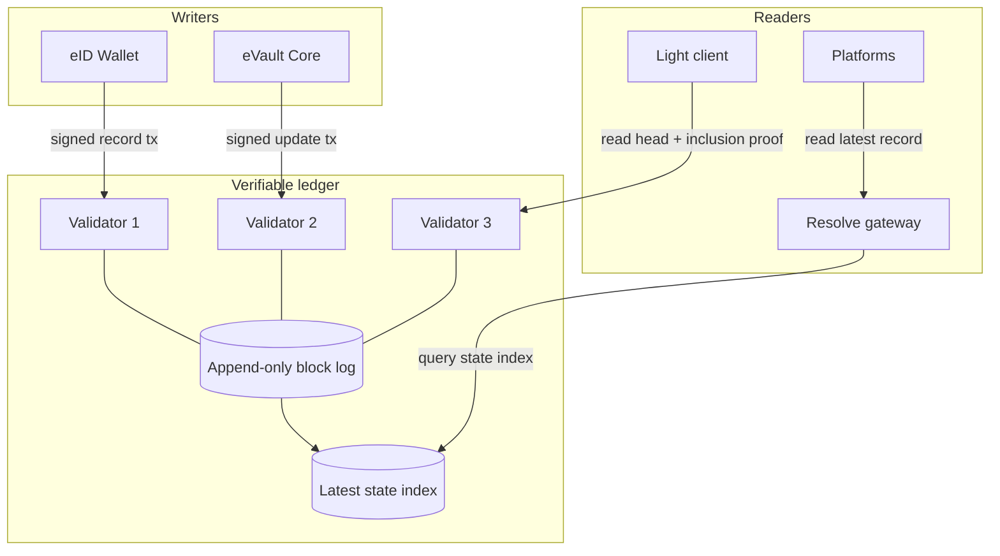
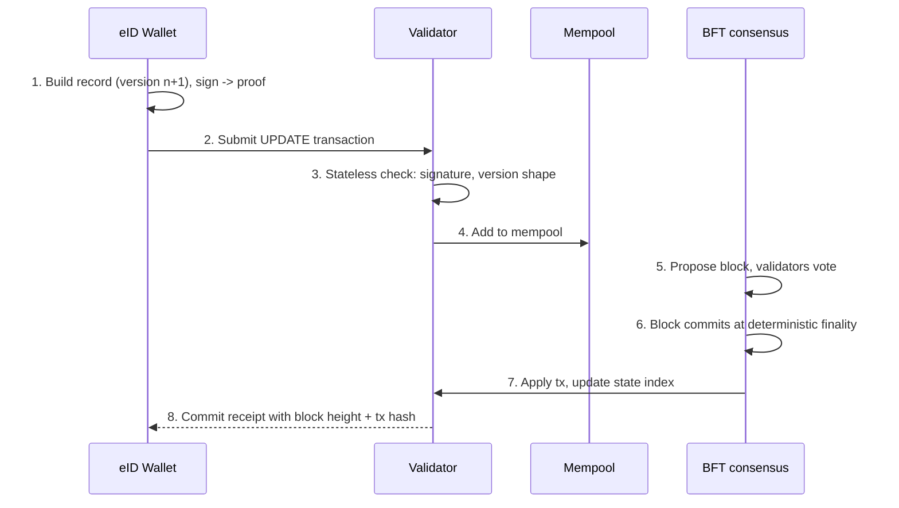
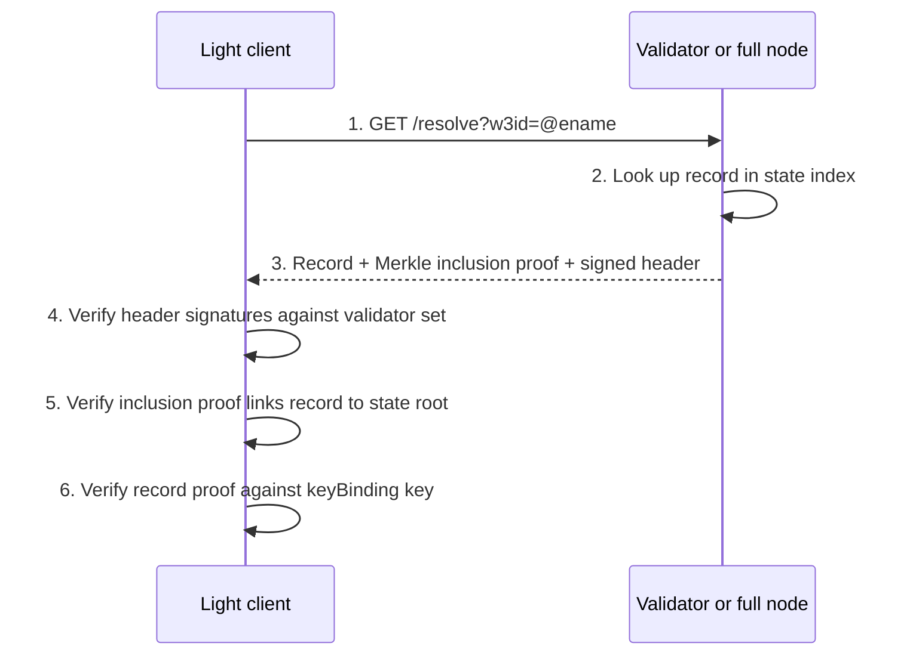

# Solution 2: Ledger-anchored registry

This page describes the second candidate design and walks through worked
examples. For the shared eName record and design goals, see the
[Overview](../).

## Summary

eName records are written as signed transactions to an append-only verifiable
[ledger](https://en.wikipedia.org/wiki/Distributed_ledger), either a
permissioned chain or a transparency log. Resolution reads the latest record
for a W3ID from any full node, or from a light client that checks a proof
against the signed ledger head. Key binding becomes a record field committed on
the ledger, which removes the temporary
[certificate authority](https://en.wikipedia.org/wiki/Certificate_authority)
shortcut entirely.

> **In plain terms**
>
> Every change is written into a shared record that has two properties: entries
> can only be added, never edited or deleted afterwards, and a group of
> independent operators must agree before any entry is added. A shared record
> with those two properties is what is usually meant by a blockchain. The
> benefit is a complete and unalterable history: you can always see when an
> entry changed and who authorised it. The cost is that writing a change takes
> a few seconds longer, because the operators have to reach agreement first.

## Topology



## Choice of ledger

The recommended starting point is a **permissioned BFT chain**. "BFT" is
[Byzantine fault tolerance](https://en.wikipedia.org/wiki/Byzantine_fault):
a way for a known group of record-keepers to keep agreeing on the truth even
if some of them crash or actively lie, as long as more than two thirds are
honest. "Permissioned" means the group of record-keepers (the validators) is a
known, vetted list, not anyone on the public internet. This is run by a known
validator set rather than a public proof-of-work or proof-of-stake chain.
Reasons:

- No cryptocurrency, token, or transaction fees are needed. This is plumbing,
  not a financial network.
- Agreement is reached, and is final, in sub-second to a few seconds. Once a
  change is accepted it will not be reversed.
- The validator set is governable, which matches the W3DS operator model.

A pure **transparency log**, an add-only log in the style of the
[Certificate Transparency](https://en.wikipedia.org/wiki/Certificate_Transparency)
system that browsers already rely on, is a lighter alternative, but it does not
by itself decide a single agreed latest state, so the BFT chain is preferred.

## Transaction types

| Transaction | Effect | Authorised by |
| --- | --- | --- |
| `REGISTER` | Creates a `version` 1 eName record | Genesis key in the record |
| `UPDATE` | Replaces a record with `version` n+1 | Previous version key |
| `ROTATE` | An `UPDATE` that changes `keyBinding.publicKey` | Previous version key |
| `MIGRATE` | An `UPDATE` that changes `uri`/`evault` and appends `alsoKnownAs` | Previous version key |

Every transaction carries the eName record `proof`. A transaction is just a
single requested change submitted to the ledger. Validators reject a
transaction whose `version` is not exactly one greater than current state, or
whose `proof` does not verify against the previous version key.
[Consensus](https://en.wikipedia.org/wiki/Consensus_(computer_science)), the
process by which the validators agree on one ordering, then fixes a single
order, so if two people race to change the same entry only one change wins and
the other is rejected cleanly.

## Write path



## Example A: registering a new eName

The eID Wallet wraps the `version` 1 record in a `REGISTER` transaction and
submits it to any validator.

```http
POST /tx HTTP/1.1
Host: validator-1.registry.w3ds.example
Content-Type: application/json

{
  "type": "REGISTER",
  "record": {
    "ename": "@e4d909c2-5d2f-4a7d-9473-b34b6c0f1a5a",
    "version": 1,
    "uri": "https://evault.example.com/users/user-a",
    "evault": "evault-001",
    "alsoKnownAs": [],
    "keyBinding": {
      "publicKey": "zDnaerx9Cp5X2chPZ8n3wK7mN9pQrS7tUvW1...",
      "alg": "ES256",
      "rotatedAt": 1737730800
    },
    "updatedAt": 1737730800,
    "proof": { "type": "ecdsa-2019", "signature": "z3FXQj..." }
  }
}
```

The validator runs a stateless check, adds the transaction to the mempool, and
returns a receipt once the block commits.

```http
HTTP/1.1 200 OK
Content-Type: application/json

{
  "txHash": "0x7a1f...c2",
  "blockHeight": 184203,
  "status": "committed"
}
```

## Example B: resolving with a light-client proof

> **In plain terms**
>
> Some software keeps a full copy of the ledger. Smaller clients, such as a
> phone app, do not. Instead of trusting whatever a server tells it, a smaller
> client can ask for a short piece of
> [proof](https://en.wikipedia.org/wiki/Merkle_tree) that the answer it
> received really is part of the agreed ledger. This lets even a phone confirm
> that an answer is genuine without having to trust the server that provided
> it.



A high-assurance platform requests the proof bundle:

```http
GET /resolve?w3id=@e4d909c2-5d2f-4a7d-9473-b34b6c0f1a5a&proof=true HTTP/1.1
Host: validator-3.registry.w3ds.example
```

```http
HTTP/1.1 200 OK
Content-Type: application/json

{
  "record": {
    "ename": "@e4d909c2-5d2f-4a7d-9473-b34b6c0f1a5a",
    "version": 3,
    "uri": "https://evault-cloud.example.org/u/user-a",
    "evault": "evault-042"
  },
  "blockHeight": 190551,
  "stateRoot": "0x9c44...ab",
  "inclusionProof": ["0x12...", "0x8e...", "0x3d..."],
  "header": {
    "height": 190551,
    "validatorSignatures": ["zSig1...", "zSig2...", "zSig3..."]
  }
}
```

The client verifies the header signatures against the known validator set,
checks that `inclusionProof` links the record hash to `stateRoot`, then
verifies the record `proof`. A trusting client may instead use a plain
`GET /resolve` gateway that returns just the `record`, exactly like the current
Registry.

## Example C: key rotation as a ROTATE transaction

```http
POST /tx HTTP/1.1
Content-Type: application/json

{
  "type": "ROTATE",
  "record": {
    "ename": "@e4d909c2-5d2f-4a7d-9473-b34b6c0f1a5a",
    "version": 2,
    "uri": "https://evault.example.com/users/user-a",
    "evault": "evault-001",
    "keyBinding": {
      "publicKey": "zNEWkeyMaterialForTheRecoveredDevice...",
      "alg": "ES256",
      "rotatedAt": 1737900000
    },
    "updatedAt": 1737900000,
    "proof": { "type": "ecdsa-2019", "signature": "z9signedByOldKey..." }
  }
}
```

Because the ledger keeps full history, a verifier checking an old signature can
resolve the record version that was current at the time of signing:

```http
GET /resolve?w3id=@e4d909c2-...&atHeight=184500 HTTP/1.1
```

## Example D: migrating to a new eVault

A `MIGRATE` transaction changes `uri` and `evault` and appends the old eVault
identifier to `alsoKnownAs`. The change is publicly auditable on the ledger.

```json
{
  "type": "MIGRATE",
  "record": {
    "ename": "@e4d909c2-5d2f-4a7d-9473-b34b6c0f1a5a",
    "version": 3,
    "uri": "https://evault-cloud.example.org/u/user-a",
    "evault": "evault-042",
    "alsoKnownAs": ["evault-001"],
    "...": "proof signed by version 2 key"
  }
}
```

## Example E: key binding without a certificate authority

> **In plain terms**
>
> In the current system one organisation acts as the trusted issuer that
> confirms a key belongs to an identity, a role known as a
> [certificate authority](https://en.wikipedia.org/wiki/Certificate_authority).
> That organisation is also a point of failure and a point at which a forgery
> could be introduced. In this design there is no issuer. The key is written
> directly into the identity's ledger entry, signed by the owner and agreed by
> the operators. To check a key you simply read the entry. The trust comes from
> the ledger and its agreement process, not from any one organisation.

In this design key binding is not a separate certificate. The `keyBinding`
field of the on-ledger record **is** the binding, and consensus plus the
self-signed `proof` chain is the authority.

- A verifier resolves the eName record and reads `keyBinding.publicKey`
  directly. There is no Registry private key and no `exp` to manage.
- For backward compatibility, a gateway can still expose
  `GET /.well-known/jwks.json` and synthesize a short-lived key binding JWT
  signed by the gateway, but that is a convenience shim, not the trust root.
  The real trust root is the ledger state and its inclusion proofs.

```text
Verifier flow:
  resolve(@ename) -> record.keyBinding.publicKey
  verify(signature, payload, publicKey)   # no JWKS fetch required
```

## Governance and operations

- The validator set is managed by an on-ledger governance transaction signed by
  a quorum of existing validators, mirroring Solution 1 operator admission.
- **Storage growth** is the main operational cost. Full nodes keep the entire
  block history. This is bounded by snapshotting: validators agree on periodic
  state snapshots and may prune blocks older than a snapshot, while archival
  nodes keep everything for historical signature verification.
- Light clients only store the current validator set and the latest trusted
  header, so client cost stays small.

## Security model and failure modes

- **Forgery**: needs either a record-key compromise, the same as Solution 1, or
  control of more than two-thirds of validators to commit an invalid block.
- **Withholding**: a single validator cannot censor, because any other
  validator can include the transaction. Censorship needs a colluding
  supermajority, and even then the attempt is publicly visible as missing
  transactions.
- **Equivocation**: a validator that double-signs is slashable and detectable
  from conflicting signed headers.
- **Stale reads**: bounded. Light clients verify against a recent signed
  header, so they cannot be served arbitrarily old state without detection.
- **Write latency**: a record is not usable until its block reaches finality,
  which is slower than a gossiped DHT write.
- **Long-range attack**: mitigated by the permissioned validator set and by
  clients pinning a recent trusted header.

## Strengths and trade-offs

Strengths: strong global consistency, a tamper-evident and auditable history of
every eName, key binding with no certificate authority and no `exp` juggling,
and light clients that trust no single node.

Trade-offs: writes wait for block finality, the validator set needs a
governance model, full-node storage grows and needs snapshotting, and
high-assurance reads add inclusion-proof verification to the client.

Continue to [Comparison and migration](../comparison).
