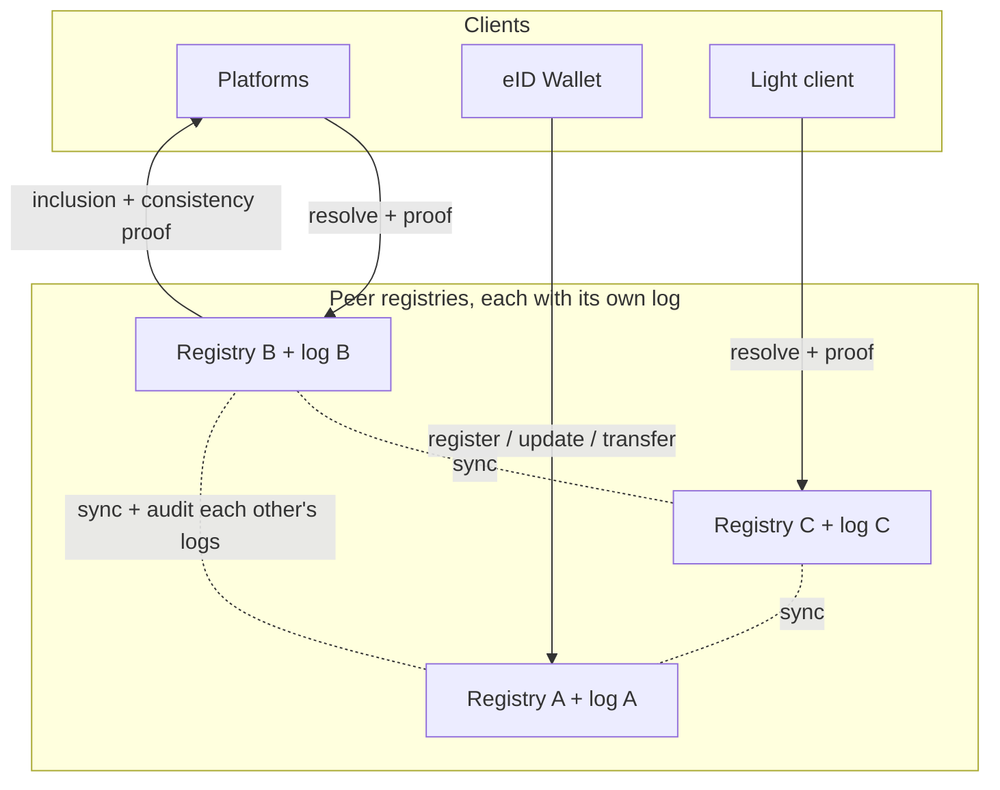
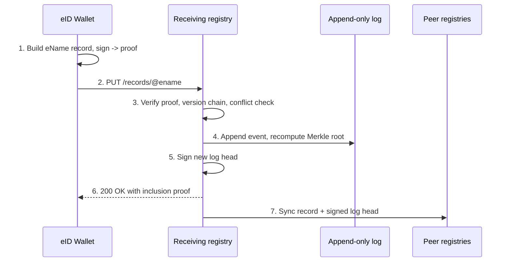
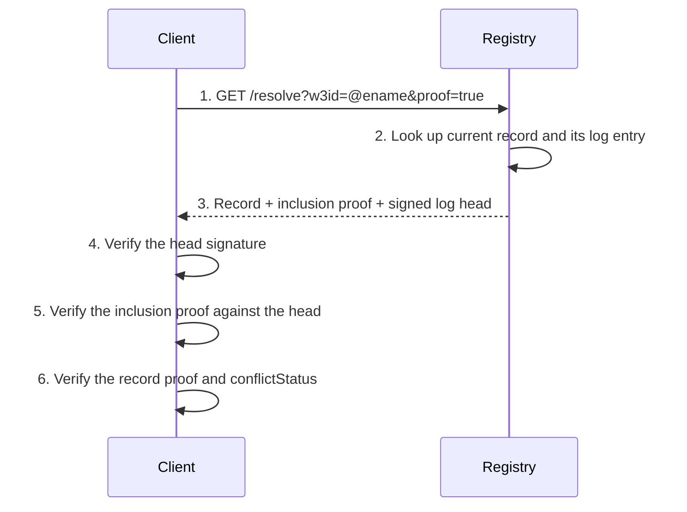
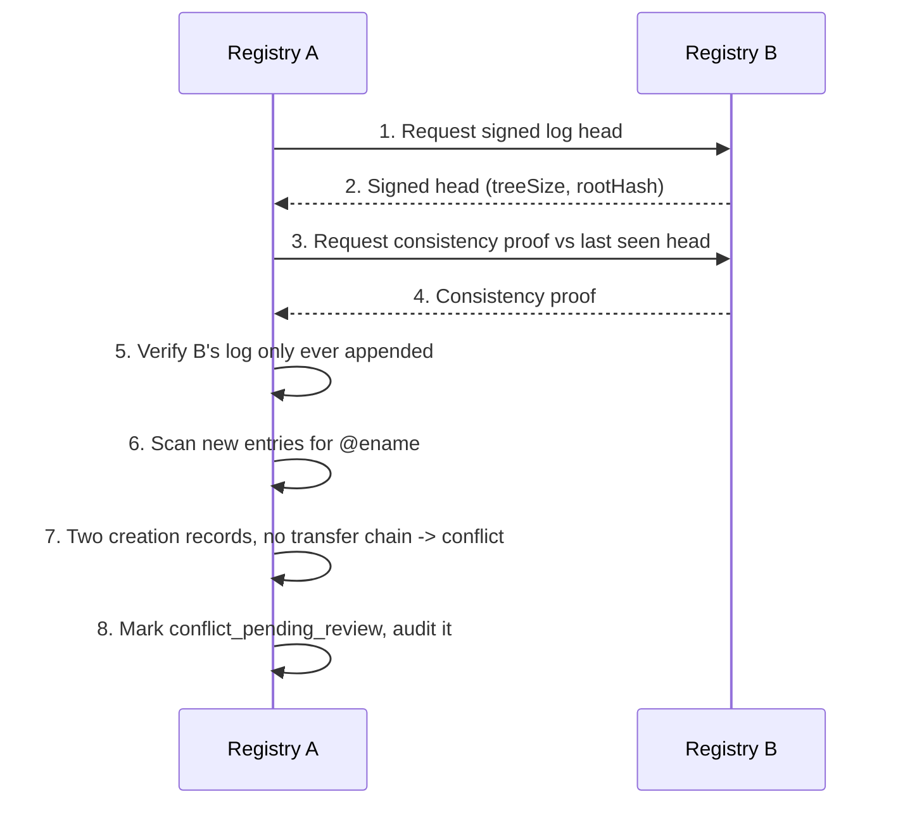

# Solution 2: Ledger-anchored

This page describes the second candidate design and walks through worked
examples. For the shared eName record, the conflict rules, and the transfer and
audit model, see the [Overview](../).

## Summary

This is the same federation of peer registries as Solution 1, with one
difference: every registry publishes every event into an **append-only,
publicly verifiable log** built as a [Merkle tree](https://en.wikipedia.org/wiki/Merkle_tree),
in the style of [Certificate Transparency](https://en.wikipedia.org/wiki/Certificate_Transparency),
the system web browsers already rely on. Peers and clients can mathematically
check that a registry's log only ever grew and never had an entry rewritten.
There is still no central root and still no global blockchain.

> **In plain terms**
>
> In Solution 1 you trust a registry's answer because the registry signed it.
> Here you can do better: you can demand proof. Each registry keeps a running
> log that can only be added to, never edited, and the maths of how the log is
> built means any later tampering is detectable. When a registry answers a
> lookup, it can attach a short proof that the answer really is in its log and
> that the log was never rewritten. Different registries also check each
> other's logs the same way, so a registry that quietly changed history would
> be caught by its peers. The cost is that every answer now carries a little
> proof, and clients do a little maths to check it.

## Topology



## What the log contains

Every event that the [Overview](../#audit-log-peer-sync-and-reputation) lists
for the audit log goes into the Merkle log: creation, update, target change,
transfer acceptance, conflict detection, conflict resolution, peer
synchronisation, and reputation change (`FR37`). Because the log is a Merkle
tree, two kinds of short proof can be produced from it:

- An **inclusion proof** shows that a specific record or event is in the log.
- A **consistency proof** shows that the current log is an append-only
  extension of an earlier version of the same log, that is, nothing was
  removed or rewritten.

A registry periodically signs the current root of its tree, called the **log
head**. The signed head plus those two proofs are what let anyone verify the
registry without trusting it.

## Write path



## Example A: registering a new eName

The creation record is identical to Solution 1. The difference is the response:
the registry returns an inclusion proof so the wallet can confirm the
registration really entered the log.

```http
PUT /records/@e4d909c2-5d2f-4a7d-9473-b34b6c0f1a5a HTTP/1.1
Host: registry-a.w3ds.example
Content-Type: application/json

{
  "ename": "@e4d909c2-5d2f-4a7d-9473-b34b6c0f1a5a",
  "class": "global",
  "controller": "@e4d909c2-5d2f-4a7d-9473-b34b6c0f1a5a",
  "evault": "@b1c2d3e4-7f80-4a11-9c22-d3e4f5061728",
  "uri": "https://evault.example.com/users/user-a",
  "version": 1,
  "creationRecord": {
    "creationTimestamp": 1737730800,
    "genesisKey": "zGenesisPublicKey...",
    "timestampProof": { "policy": "7-of-10", "witnesses": ["..."] },
    "proof": { "type": "ecdsa-2019", "signature": "zGenesisSelfSignature..." }
  },
  "transferChain": [],
  "controlKey": "zGenesisPublicKey...",
  "conflictStatus": "none",
  "updatedAt": 1737730800,
  "proof": { "type": "ecdsa-2019", "signature": "z3FXQj..." }
}
```

```http
HTTP/1.1 200 OK
Content-Type: application/json

{
  "ename": "@e4d909c2-...",
  "version": 1,
  "logEntry": 48213,
  "inclusionProof": ["0x12...", "0x8e...", "0x3d..."],
  "logHead": {
    "treeSize": 48214,
    "rootHash": "0x9c44...ab",
    "signature": "zSignedByRegistryA..."
  }
}
```

## Example B: resolving with a proof



```http
GET /resolve?w3id=@e4d909c2-5d2f-4a7d-9473-b34b6c0f1a5a&proof=true HTTP/1.1
Host: registry-b.w3ds.example
```

```http
HTTP/1.1 200 OK
Content-Type: application/json

{
  "record": {
    "ename": "@e4d909c2-5d2f-4a7d-9473-b34b6c0f1a5a",
    "uri": "https://evault-cloud.example.org/u/user-a",
    "evault": "@f9a8b7c6-1234-4def-8a9b-0c1d2e3f4051",
    "conflictStatus": "none"
  },
  "logEntry": 51904,
  "inclusionProof": ["0x4a...", "0x77...", "0xb1..."],
  "logHead": {
    "treeSize": 60002,
    "rootHash": "0x1f88...c0",
    "signature": "zSignedByRegistryB..."
  }
}
```

A registry that wants a drop-in replacement for the current API can also serve
a plain `GET /resolve` that returns just the `record`. The proof is opt-in for
clients that want to verify rather than trust. Either way, resolution returns
the current accepted target (`FR7`) and any conflict metadata (`FR8`).

## Example C: key rotation

Key rotation is the same signed `version` 2 update as in
[Solution 1, Example C](../federated-dht/#example-c-key-rotation-after-a-lost-device).
The only addition is that the rotation event is appended to the log, so anyone
can later prove exactly when the control key changed.

## Example D: transferring to a new eVault

The transfer record is identical to
[Solution 1, Example D](../federated-dht/#example-d-transferring-to-a-new-evault):
a signed entry appended to `transferChain`, never a target overwrite (`FR26`,
`FR27`), with the genesis record preserved (`FR30`). The transfer also becomes a
log entry, so the full ownership history of the eName is provable from the log
rather than merely asserted.

## Example E: detecting a conflict by comparing logs

Because every registry's history is an append-only log, conflict detection does
not depend on catching a write in the act. A registry can compare its log
against a peer's at any time.



Both registries mark the entry `conflict_pending_review` and never silently
overwrite (`FR9`, `FR21`, `FR25`). The winner is decided by the same
deterministic rule as Solution 1: the oldest valid witnessed creation timestamp
(`FR24`, `NFR7`). The advantage here is that the consistency proof also catches
a registry that tried to **rewrite** its own past, for example to backdate a
creation record. That tampering breaks the consistency proof and is detected by
every peer that checks.

## Resolving historical state

Because the log is append-only and never pruned of its structure, a verifier
checking an old signature can ask for the record state as of a past log entry,
and receive an inclusion proof against the log head at that size. This replaces
any need for a separate time-travel query: history is simply the earlier part
of the same log.

## Security model and failure modes

- **Forgery**: same as Solution 1, the self-signed record chain prevents it.
- **History rewriting**: this is what the log adds. A registry that edits or
  reorders its past fails the consistency proof, and every peer and client that
  checks will see it. In Solution 1 the same attack is only caught by comparing
  full copies.
- **Withholding**: a registry can still refuse to answer, but it cannot answer
  *dishonestly* without detection, and other registries still hold the data.
- **Split-view attack**: a registry could try to show different logs to
  different clients. This is mitigated the same way Certificate Transparency
  mitigates it: peers gossip the log heads they have seen, so two divergent
  heads from the same registry become visible.
- **Stale reads**: still possible, the system remains
  [eventually consistent](https://en.wikipedia.org/wiki/Eventual_consistency)
  as required (`NFR4`), but a client verifies against a recent signed head and
  cannot be served silently rewritten history.

## Strengths and trade-offs

Strengths: the append-only audit requirement (`FR37`, `FR38`) is satisfied with
cryptographic proof rather than trust; clients and peers can verify a registry
instead of believing it; and history rewriting is detectable, not just
discouraged.

Trade-offs: every answer carries a proof and every client does a little
verification work; registries store the full log structure, which grows over
time; and producing and checking proofs is more engineering than a plain
key-value store. The federation, the conflict rules, and the eventual
consistency model are otherwise identical to Solution 1.

Continue to [Comparison and migration](../comparison).
