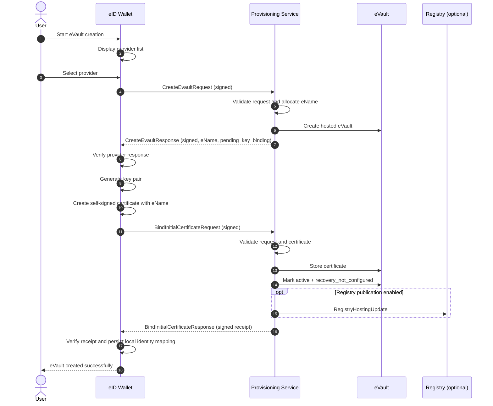
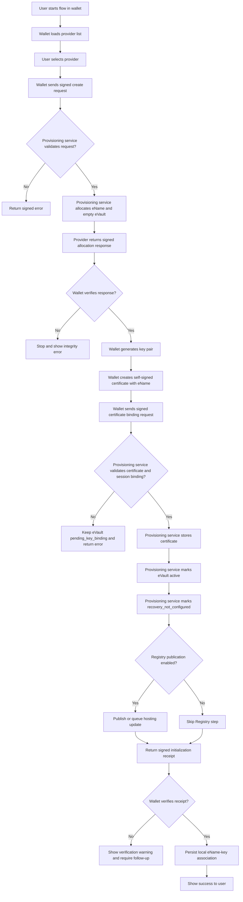

# eVault Creation Architecture

## High-Level Explanation

The eVault creation flow is a two-phase initialization process. First, the Cloud Provider allocates an eName and an empty hosted eVault. Second, the eID Wallet generates the user's initial key pair, creates a self-signed certificate containing that eName, and binds the certificate to the hosted eVault. After successful binding, the provider activates the eVault and records that recovery is not yet configured.

Two important variants relax the second phase:

- a child eVault may be created with deferred subject key binding
- an organization eVault may exist without subject signature capability

For delegated and advanced variants, the provider runs an internal Provisioning Service inside the eVault management system. This internal service authenticates initiators, collects and validates authority evidence, allocates `eName`, and orchestrates the final control-model commitment.

## Sequence Diagram

## Activity Diagram

## Data Flow

| Step | Data Produced | Producer | Consumer |
|---|---|---|---|
| Provider selection | Provider identifier | Wallet UI | Wallet orchestrator |
| Create request | Signed provisioning request, correlationId, timestamp, nonce | Wallet or delegated client | Provisioning Service |
| Allocation response | eName, eVault reference, pending state, provider nonce, signed response | Provisioning Service | Wallet or delegated client |
| Key generation | Private key, public key | Wallet | Wallet secure storage / certificate builder |
| Certificate binding request | eName, certificate, signed request, correlation data | Wallet or bootstrap environment | Provisioning Service |
| Initialization commit | Stored certificate, evidence state, hosting metadata, active state | Provisioning Service | eVault |
| Optional publication | Hosting reference | Provisioning Service | Registry |
| Final receipt | Signed confirmation of activation | Provisioning Service | Wallet or delegated client |

## Variant-Specific Architectural Notes

### Child eVault Created by Parent

- The initiator and the dependent human subject are different actors.
- Allocation may complete before the child has wallet-managed keys.
- The architecture must preserve a visible difference between "eVault exists" and "child controls it".
- The architecture should allow parenthood or guardianship evidence to be attached at creation time.

### Organization eVault

- The subject may not be representable by a single signing key.
- The architecture must not assume every eVault can self-sign.
- Authorization must rely on an explicit governance model.
- The architecture should support validation of authorization chains and corporate evidence packages.

### Key-Owning Non-Human Entity

- The subject owns operational keys and may sign or authenticate on its own behalf.
- Recovery and higher-level governance are linked to a trusted controller.
- The architecture must preserve both subject operational autonomy and trusted-controller authority.

## Architectural Constraints

- Identity allocation and certificate binding must remain distinct operations.
- `eName` generation should occur inside the provider-side provisioning service.
- The wallet must not generate the certificate against an assumed eName.
- The provider must not activate the eVault before certificate persistence succeeds.
- Recovery setup must remain a separate lifecycle flow.
- Signed receipts are strongly recommended to support verifiable completion.
