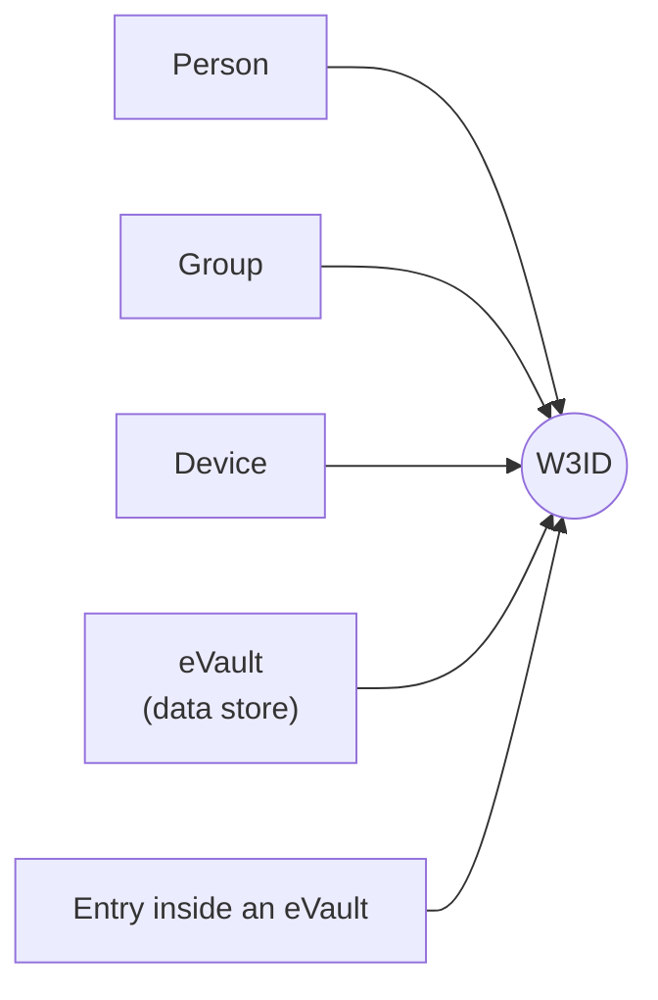

# Identifiers

In W3DS, every person, group, device, and data store has a name. That name is
called a **W3ID**. This section explains what a W3ID is, how it stays the same
over a person's lifetime, and how new ones are created without two people
ending up with the same one.

The full requirements this section is meant to satisfy live here:
[W3ID and eName Requirements](https://github.com/w3ds-docs/w3ds-docs/wiki/W3ID-eName-Requirements).

> **In plain terms**
>
> A W3ID is a name that computers use to find someone or something. People
> have one. Groups have one. Each [eVault](/docs/Infrastructure/eVault), which
> is the data store that holds a person's information, has one. Every entry
> inside an eVault has one. It is the single name that everything else in
> W3DS uses to point at the same thing.

## Where W3IDs show up

Every box on the left **has** a W3ID. That single W3ID is the only piece of
text another computer needs to find the thing the box describes.

## Two words you will see a lot

- **W3ID**: the technical name for the identifier. Always a string of letters
  and numbers in a fixed shape.
- **eName**: a W3ID used for a **first-class citizen of the ecosystem**: a
  person, organisation, group, device, or eVault controller. Every eName is
  a global W3ID and is registered in the registry. The word "eName" is the
  one used in public, name-like contexts, while "W3ID" is the technical
  term that covers every identifier in the system, including the local ones
  that live inside a single eVault.

The next pages explain how a W3ID is written, why it never has to change, and
how new ones are made.
