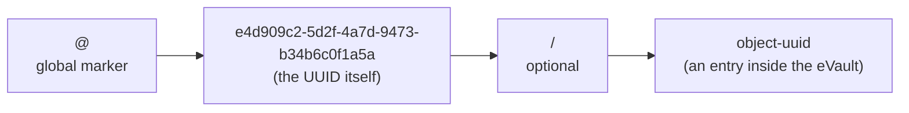

# What a W3ID looks like

A W3ID is a [UUID](https://en.wikipedia.org/wiki/Universally_unique_identifier),
which is a long, random-looking string of letters and numbers. UUIDs are
designed so that two computers generating them at random will almost certainly
never pick the same one.

> **In plain terms**
>
> It is just a long chain of characters. It is long enough that no two people
> will get the same one by accident. It has a fixed shape so software can
> recognise it. It uses lowercase or uppercase, both are accepted.

## The shape



Reading left to right:

- **`@`** at the start means this is a **global** W3ID. Anyone in W3DS can
  look it up.
- The **UUID** is the random string. Dashes are always in the same places.
  Case does not matter; the same UUID in upper case and lower case is the
  same UUID.
- **`/`** plus another UUID is optional. It points at one specific entry
  inside that person's eVault, for example one post or one document.

## The three classes

There are three names you will hear for these identifiers. They all use the
same UUID format; what differs is what they point at and who can use them.
The picture below shows how the three sets relate.

<p>
<svg viewBox="0 0 640 380" xmlns="http://www.w3.org/2000/svg" role="img" aria-label="Venn diagram of identifier classes">
  <rect x="10" y="10" width="620" height="360" fill="none" stroke="currentColor" stroke-width="2" stroke-dasharray="6 6" rx="10"/>
  <text x="24" y="34" font-size="14" fill="currentColor" font-weight="bold">All W3IDs</text>

  <circle cx="220" cy="210" r="140" fill="currentColor" fill-opacity="0.10" stroke="currentColor" stroke-width="2"/>
  <text x="220" y="95" text-anchor="middle" font-size="15" fill="currentColor" font-weight="bold">Global W3ID</text>
  <text x="220" y="113" text-anchor="middle" font-size="12" fill="currentColor">starts with @</text>

  <circle cx="240" cy="230" r="80" fill="currentColor" fill-opacity="0.18" stroke="currentColor" stroke-width="2"/>
  <text x="240" y="210" text-anchor="middle" font-size="14" fill="currentColor" font-weight="bold">eName</text>
  <text x="240" y="228" text-anchor="middle" font-size="11" fill="currentColor">for first-class citizens:</text>
  <text x="240" y="242" text-anchor="middle" font-size="11" fill="currentColor">people, organisations,</text>
  <text x="240" y="256" text-anchor="middle" font-size="11" fill="currentColor">groups, devices, eVaults</text>

  <circle cx="490" cy="210" r="110" fill="currentColor" fill-opacity="0.10" stroke="currentColor" stroke-width="2"/>
  <text x="490" y="195" text-anchor="middle" font-size="15" fill="currentColor" font-weight="bold">Local W3ID</text>
  <text x="490" y="215" text-anchor="middle" font-size="12" fill="currentColor">no @, lives inside</text>
  <text x="490" y="230" text-anchor="middle" font-size="12" fill="currentColor">one eVault</text>
  <text x="490" y="252" text-anchor="middle" font-size="11" fill="currentColor" font-style="italic">can be promoted</text>
  <text x="490" y="266" text-anchor="middle" font-size="11" fill="currentColor" font-style="italic">to a Global W3ID</text>
</svg>
</p>

Read the picture this way:

- The big dashed box is the whole world of W3IDs.
- The **Global W3ID** circle on the left contains every identifier that
  starts with `@`. **All Global W3IDs are registered in a registry**, that
  is what makes them resolvable anywhere in W3DS.
- Inside it, the smaller **eName** circle is reserved for the
  **first-class citizens of the ecosystem**: people, organisations, groups,
  devices, and eVault controllers. Every eName is a Global W3ID, but not
  every Global W3ID is an eName: identifiers for ordinary internal
  resources stay outside this inner circle.
- The **Local W3ID** circle on the right is separate: those identifiers
  only mean something inside one eVault and are not in the registry. A
  Local W3ID can later be **promoted** into a Global W3ID if it needs to
  be addressable elsewhere.

- **Global W3ID**: starts with `@`. It can be looked up across W3DS and
  points to an [eVault](/docs/Infrastructure/eVault).
- **Local W3ID**: no `@`. It only means something inside one eVault, for
  example "post number 7 in this user's eVault". It can be combined with the
  owner's global W3ID to make it globally addressable:
  `@owner-uuid/local-uuid`.
- **eName**: an everyday word for a global W3ID that is registered in the
  W3DS directory. People, groups, devices, and eVault controllers normally
  have an eName.

## Examples

```text
Global W3ID  (eName):       @e4d909c2-5d2f-4a7d-9473-b34b6c0f1a5a
Local W3ID:                 f2a6743e-8d5b-43bc-a9f0-1c7a3b9e90d7
Scoped local W3ID:          @e4d909c2-5d2f-4a7d-9473-b34b6c0f1a5a/f2a6743e-8d5b-43bc-a9f0-1c7a3b9e90d7
```

## Rules to remember

- A W3ID **is** a UUID, written with the standard dashes. Case is ignored.
- A global W3ID **starts with `@`** and **is registered in a registry**, so
  the rest of W3DS can find it. A local one does neither.
- An **eName** is a global W3ID whose subject is a first-class citizen of the
  ecosystem: a person, organisation, group, device, or eVault controller.
  Every eName is a registered global W3ID; not every registered global W3ID
  is an eName.
- The UUID space is huge (around 5 followed by 36 zeros), so the chance of
  two random W3IDs colliding is essentially zero. If we ever needed more
  room, the format leaves space for a bigger identifier later.

## Free identifiers

Not every identifier in the ecosystem points at something that can be looked
up or owned. A plain word like `Paris` or `Communism` is also a valid
identifier. It just does not behave like a W3ID: nobody owns it, no registry
resolves it, and there is no eVault behind it.

> **In plain terms**
>
> Some names refer to a specific, findable thing, like a person's eVault.
> Other names refer to an idea or a place that everyone can mention but
> nobody controls. Both are allowed. The difference is that the first kind
> can be resolved to a real location and is owned by someone, while the
> second kind is just a shared label whose meaning is left to whoever reads
> it.

So identifiers fall into two broad groups:

- **Resolvable, owned identifiers**: W3IDs and eNames. They are registered,
  they resolve to an eVault, and a controller is responsible for them.
- **Free identifiers**: ordinary words and phrases. They need no resolution,
  have no owner, and their meaning is a matter of interpretation. The
  ecosystem allows them so that anything can be referred to, even things that
  have no eVault and never will.

For full format details, see the [W3ID prototype page](/docs/W3DS%20Basics/W3ID).
