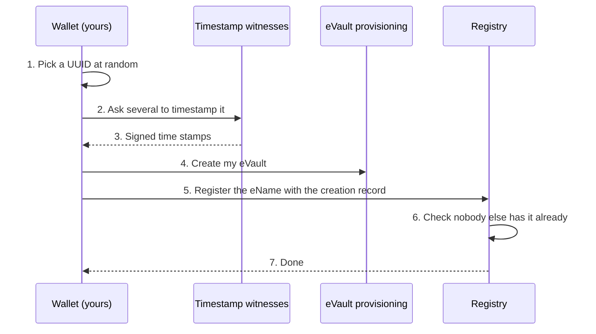
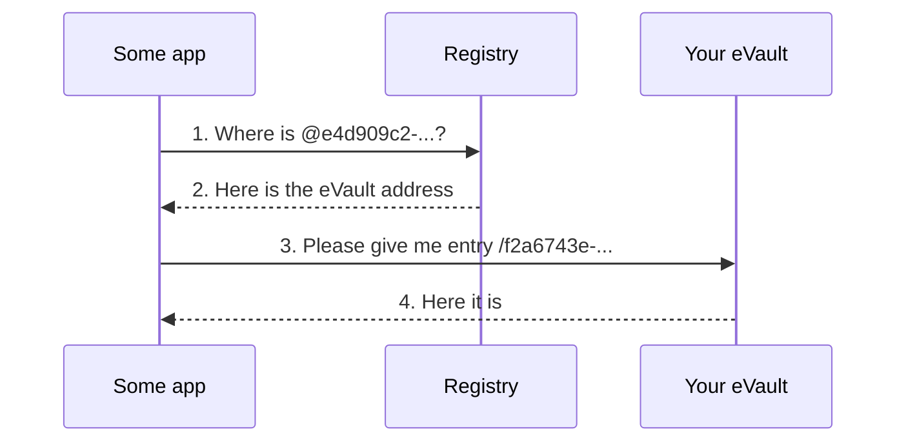
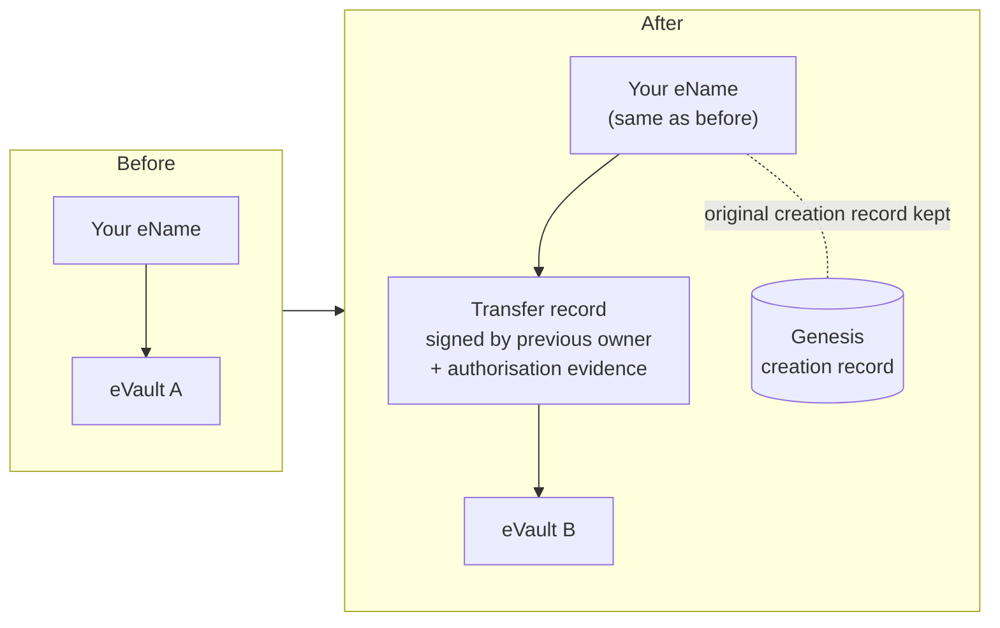
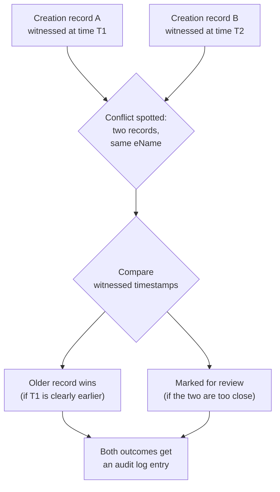

# Creation, resolution, transfer, conflicts

A W3ID lives a whole life: it is created, it is looked up by other systems,
it can be moved to a new eVault, and once in a while two people may
accidentally pick the same one. This page walks through each of those four
moments.

## Creating a W3ID

A new W3ID is normally created at the moment a person, group, or device gets
their first eVault. The wallet app generates the UUID, asks a small set of
independent **timestamp witnesses** to vouch for the creation time, and then
hands the whole creation record to a registry.

> **In plain terms**
>
> When you make a new W3ID, you do not just pick a name. You also gather
> signed notes from several independent timestamp services saying "yes, this
> name first appeared at this moment". That makes it very hard for someone
> else to come along later and claim they had it first.

A few rules from the requirements:

- The creation record **must** carry a creation timestamp.
- The timestamp **should** be backed by signed witnesses, ideally a quorum
  like **7 out of 10** independent witnesses, so a single rogue witness
  cannot lie about the time.
- The registry **must** do a best-effort check to see whether someone else
  already registered the same name. The check is best-effort because a
  conflict can still happen, see [Conflicts](#conflicts) below.

### Reserving a W3ID for someone who is not on W3DS yet

It is allowed to create a W3ID for a person, company, or organisation that
is not yet using W3DS, for example so a friend can attach evidence about
them. Those records carry identity evidence (a legal name, a passport
number, an organisation registration, and so on) and still go through the
duplicate check. This is a prototype-level feature.

## Resolving a W3ID

When another system wants to find you, it does not need to know where your
eVault lives. It only needs your eName. The lookup goes through the
registry, which is the directory that knows the current address of every
registered eVault.

This is also why W3IDs do not depend on the regular internet domain name
system (DNS): the identity layer needs to keep working even if a domain
disappears.

## Transferring to a new eVault

You can switch eVault providers. Your eName does not change, but the
registry needs to know that you have moved. This is done with a signed
**transfer record**, not by quietly overwriting the old address.

The transfer record carries:

- the previous eVault, the new eVault, and the time the move took effect;
- a reference to the original creation record (which is **never**
  overwritten);
- a hash of the transfer document;
- signatures from the right people, plus any extra authorisation evidence
  that the ecosystem accepts.

A registry will only point your eName at the new eVault if the chain of
transfer records links cleanly back to your original creation record.

## Conflicts

Sometimes two creations slip past the duplicate check, for example because
two registries were temporarily out of touch. The W3ID requirements treat
duplicates as **conflicts**, never as something to be quietly merged.

The picture below shows what a conflict actually is: two registries each
hold their own pile of records, and one eName happens to appear in both
piles pointing at different places. The overlap is the conflict.

<svg viewBox="0 0 640 320" xmlns="http://www.w3.org/2000/svg" role="img" aria-label="Two registries with one overlapping eName">
  <rect x="10" y="10" width="620" height="300" fill="none" stroke="currentColor" stroke-width="2" stroke-dasharray="6 6" rx="10"/>
  <text x="24" y="34" font-size="14" fill="currentColor" font-weight="bold">Two registries, one clash</text>

  <circle cx="240" cy="180" r="130" fill="currentColor" fill-opacity="0.10" stroke="currentColor" stroke-width="2"/>
  <text x="180" y="100" text-anchor="middle" font-size="15" fill="currentColor" font-weight="bold">Registry A's records</text>

  <circle cx="400" cy="180" r="130" fill="currentColor" fill-opacity="0.10" stroke="currentColor" stroke-width="2"/>
  <text x="460" y="100" text-anchor="middle" font-size="15" fill="currentColor" font-weight="bold">Registry B's records</text>

  <text x="155" y="190" text-anchor="middle" font-size="12" fill="currentColor">@alice</text>
  <text x="155" y="208" text-anchor="middle" font-size="12" fill="currentColor">@bob</text>
  <text x="155" y="226" text-anchor="middle" font-size="12" fill="currentColor">@carol</text>

  <text x="485" y="190" text-anchor="middle" font-size="12" fill="currentColor">@dave</text>
  <text x="485" y="208" text-anchor="middle" font-size="12" fill="currentColor">@eve</text>
  <text x="485" y="226" text-anchor="middle" font-size="12" fill="currentColor">@frank</text>

  <text x="320" y="180" text-anchor="middle" font-size="14" fill="currentColor" font-weight="bold">@same</text>
  <text x="320" y="200" text-anchor="middle" font-size="11" fill="currentColor">two different</text>
  <text x="320" y="214" text-anchor="middle" font-size="11" fill="currentColor">eVaults</text>
  <text x="320" y="232" text-anchor="middle" font-size="11" fill="currentColor" font-style="italic">CONFLICT</text>
</svg>

When the two registries next sync, both spot the overlap, both mark the
entry as in conflict, and the resolution rules kick in.

The rules:

- The registry **must** detect the conflict and **must not** silently pick
  one record.
- The default winner is the record with the oldest **valid** creation
  timestamp.
- If the timestamps are too close, or the evidence is too thin, the entry is
  marked `conflict_pending_review` and a human or policy decides.
- Other inputs feed into the decision: first-seen evidence from trusted
  registries, the reputation of the registries involved, any transfer
  records, and the audit log.

The conflict and its resolution are both written to the audit log, so the
history is recoverable later.

## What happens next

Continue to [Requirements coverage](requirements-coverage) for a row-by-row
map from each requirement to the part of these pages that satisfies it.
