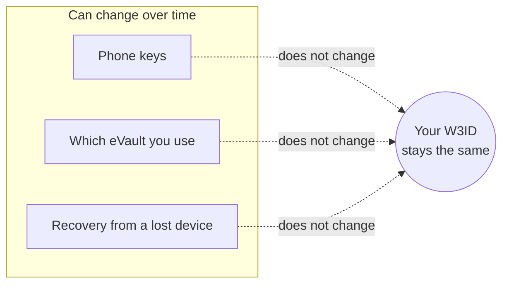
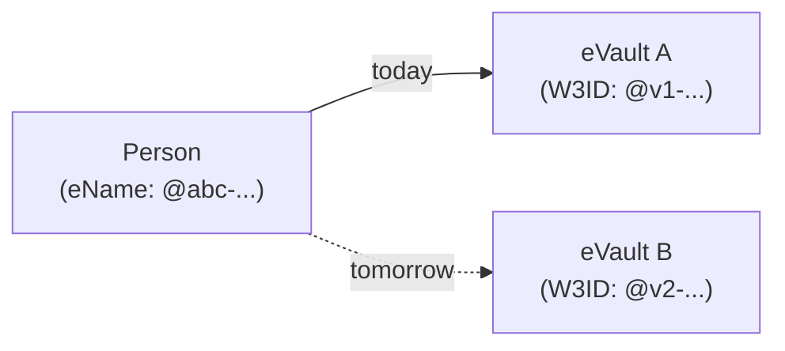

# How a W3ID stays the same

A W3ID is designed to last as long as the person, group, or device it
identifies. The whole point is that other people, other apps, and other
systems can use the same name to reach you for years and never have to update
their records.

The requirement document gives a target of **500 years or more**. That is the
horizon we are designing for.

> **In plain terms**
>
> A W3ID is more like a passport number than a phone number. You can lose
> your phone, change carriers, or move countries; the passport number on file
> at the embassy stays the same. A W3ID is the same idea, but for digital
> services.

## What can change without changing the W3ID

Three things in particular can change underneath without ever changing your
W3ID:

- **Your keys.** Cryptographic keys can be rotated (replaced) at any time,
  for example after losing a phone. The W3ID is **not** built from your
  keys, so a new key does not produce a new W3ID.
- **Your eVault.** You can move from one eVault provider to another (see
  [Transfer](lifecycle#transferring-to-a-new-evault)). Your W3ID stays
  the same, and lookups follow you.
- **Recovery after a lost device.** If a small group of trusted people or
  notaries vouch for you, you can install new keys on a new device and
  carry on, all without changing your W3ID.

## A W3ID is not a key

The picture below sums up the rule: a W3ID, the keys you use to prove
you are you, and the eVault that holds your data are three **separate**
things. None of them is built from the others, so any one of them can
change without breaking the other two.

<svg viewBox="0 0 640 280" xmlns="http://www.w3.org/2000/svg" role="img" aria-label="Three independent things: W3ID, keys, eVault">
  <rect x="10" y="10" width="620" height="260" fill="none" stroke="currentColor" stroke-width="2" stroke-dasharray="6 6" rx="10"/>
  <text x="24" y="34" font-size="14" fill="currentColor" font-weight="bold">Three independent things</text>

  <circle cx="140" cy="160" r="80" fill="currentColor" fill-opacity="0.12" stroke="currentColor" stroke-width="2"/>
  <text x="140" y="155" text-anchor="middle" font-size="15" fill="currentColor" font-weight="bold">Your W3ID</text>
  <text x="140" y="175" text-anchor="middle" font-size="12" fill="currentColor">never changes</text>

  <circle cx="320" cy="160" r="80" fill="currentColor" fill-opacity="0.12" stroke="currentColor" stroke-width="2"/>
  <text x="320" y="155" text-anchor="middle" font-size="15" fill="currentColor" font-weight="bold">Your keys</text>
  <text x="320" y="175" text-anchor="middle" font-size="12" fill="currentColor">can be rotated</text>

  <circle cx="500" cy="160" r="80" fill="currentColor" fill-opacity="0.12" stroke="currentColor" stroke-width="2"/>
  <text x="500" y="155" text-anchor="middle" font-size="15" fill="currentColor" font-weight="bold">Your eVault</text>
  <text x="500" y="175" text-anchor="middle" font-size="12" fill="currentColor">can be moved</text>

  <text x="320" y="260" text-anchor="middle" font-size="12" fill="currentColor" font-style="italic">No overlap: changing one does not change the others.</text>
</svg>

The W3ID is **not** derived from any key or password. This matters because:

- Keys can be lost, stolen, or rotated. If the W3ID was built from a key,
  losing the key would mean losing the identity.
- A W3ID can exist **before** any key is created (for example when an
  organisation reserves an eName for a person who has not joined yet).
- A W3ID can identify something that has no key at all (for example a
  reference to a real-world organisation).

The key and the W3ID are linked through separate **key binding** records,
which can be updated whenever keys change.

## A person and their eVault are different things

A person has an eName. The eVault that currently holds that person's data
**also** has its own W3ID. They are kept separate on purpose.

- The **eName** is the long-lived reference to the person. Other systems
  store this.
- The **eVault W3ID** identifies one specific data store. If the person
  moves to a new provider, a new eVault W3ID comes into play, but the
  person's eName does not change.
- That is why long-term references should use the person's **eName** rather
  than whatever eVault happens to host them today.

## Why this matters in one sentence

If your name as far as the rest of W3DS is concerned can survive a lost
phone, a switched provider, and a friend-assisted recovery, then your
identity does not depend on any single piece of hardware, any single
company, or any single key.
