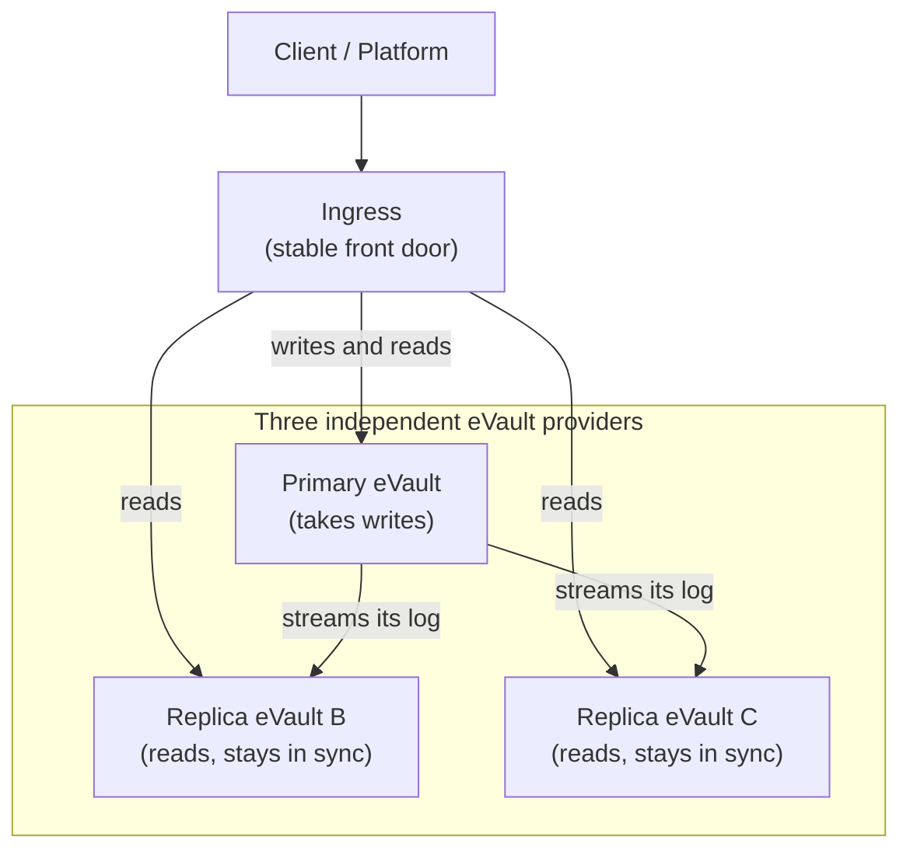
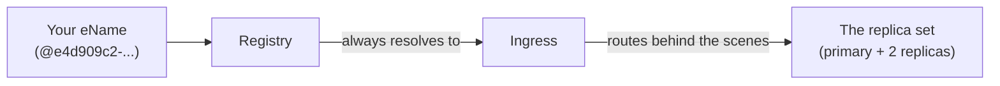

# Redundant eVaults

An [eVault](/docs/Infrastructure/eVault) holds a person's data. If that single
eVault goes offline or loses a disk, the person is locked out or loses
information. This section proposes making eVaults **durable** and **highly
available** by giving every user **three eVault replicas**, run by independent
providers, that hold the same data and cover for each other.

> **In plain terms**
>
> Instead of keeping your data in one place, you keep three copies with three
> different companies. You always reach them through one stable address, so you
> never have to know which copy you are talking to. If one company has an
> outage, the other two keep working, and the system quietly picks a new leader
> without you noticing.

## The three goals

- **Durable**: once the system tells you a change is saved, that change is not
  lost, even if a machine crashes a second later. This is the job of the
  [Write-Ahead Log](durability).
- **Redundant**: the same data lives on three independent eVaults at once, so
  losing one changes nothing for the user. This is the job of
  [replication](redundancy).
- **Self-healing**: if the leader fails, the survivors promote a new leader
  automatically and the old one rejoins later. This is the job of
  [failover](failover).

## The shape of the system

One of the three replicas is the **primary**. It is the only one that accepts
writes. The other two are **replicas**: they stay in sync with the primary and
can serve reads. The user reaches all of this through a single **ingress**, a
stable front door that knows which replica is currently the primary and routes
each request to the right place.

## The Registry stays dumb

This design deliberately keeps the [Registry](/docs/Infrastructure/Registry)
out of the picture. The user's eName does **not** point at any individual
eVault. It resolves to the **ingress** and nothing else. Everything about which
replica is primary, and any leader change during a failure, happens **behind**
the ingress.

Because the eName always resolves to the same ingress, a failover never
changes anything the Registry stores. The Registry does not know or care which
replica is primary. This also keeps the user's eName cleanly separate from the
individual eVault W3IDs, exactly as described in
[Identifiers](/docs/architecture/identifiers/lifetime/#a-person-and-their-evault-are-different-things):
the eName is the long-lived reference to the person, and each replica eVault
has its own distinct eVault W3ID underneath.

> **A note on the ingress**
>
> The ingress must itself be made redundant, otherwise it becomes the new
> single point of failure. In practice that means more than one ingress address
> behind the same stable name. The important property for this proposal is that
> the eName to ingress mapping is stable, so the Registry never has to change
> during a failure.

The next three pages cover each goal in turn:
[durability](durability), [redundancy](redundancy), and
[failover](failover).
