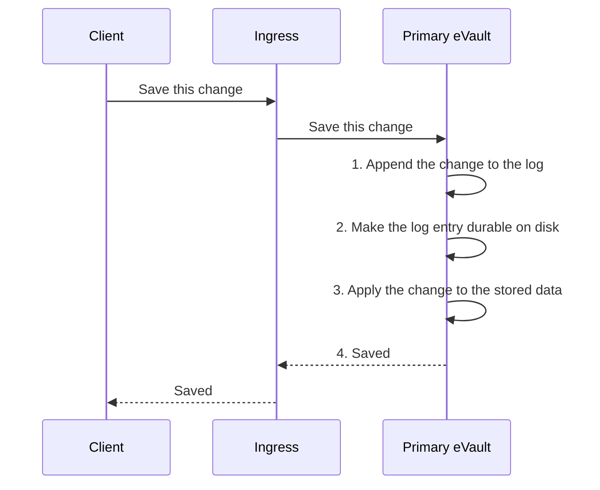
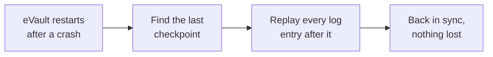

# Durability: the Write-Ahead Log

Durability means one simple promise: once the system tells you a change is
saved, that change will survive a crash. The way to keep that promise is a
**Write-Ahead Log**, the same technique [PostgreSQL](https://www.postgresql.org/docs/current/wal-intro.html)
uses.

> **In plain terms**
>
> Before the eVault touches the actual data, it first writes down what it is
> about to do in a log, and makes sure that log entry is safely on disk. Only
> then does it make the change and tell you "saved". If the power goes out a
> moment later, the eVault reads its log back when it restarts and re-does any
> change that was written down but not yet finished. Nothing you were told was
> saved can be lost.

## Write the log first, then the data

The rule that gives the technique its name is that the log is **written ahead**
of the data. Every change follows the same order.

The acknowledgement at step 4 only goes out **after** step 2. That is the whole
trick: the moment you are told "saved", the change is already safely recorded,
even if the eVault crashes before step 3 finishes. On restart it replays the
log and completes any half-applied change.

## This builds on what the eVault already has

The prototype eVault already keeps an append-only record of every operation at
its [`/logs` endpoint](/docs/Infrastructure/eVault#logs): one entry per create,
update, or delete, each with the affected envelope, a content hash, the
operation type, the platform, and a timestamp.

The Write-Ahead Log promotes that existing log from a side record into the
**durable source of truth**. Each entry also carries an ever-increasing
**sequence number** so the entries have a strict order. Everything downstream,
replication and failover included, is built on replaying these numbered entries
in order. The stored data is just the result of applying the log; the log is
what actually has to survive.

## Recovery after a crash

When an eVault restarts, it does not trust its stored data blindly. It finds
the last point it knows is fully written (a **checkpoint**), then replays every
log entry after that point up to the end of the log. Anything acknowledged is
in the log, so anything acknowledged is restored.

## Making the log trustworthy across independent providers

Because the three replicas are run by **independent providers**, a replica
cannot simply be trusted to store the log honestly. A faulty or malicious
provider could try to drop an entry, reorder entries, or invent one. The log is
made **tamper-evident** to stop this:

- Each log entry includes the **hash of the previous entry**, so the entries
  form an unbroken chain. Removing or reordering any entry breaks the chain and
  is immediately visible.
- Each entry is **signed by the primary eVault**. A replica cannot fabricate an
  entry the primary never produced, because it cannot forge that signature.

> **In plain terms**
>
> Every page of the log is stamped with a fingerprint of the page before it,
> and signed. If anyone tears out a page, swaps two pages, or slips in a fake
> page, the fingerprints stop matching and everyone can see the log was
> tampered with.

This is what lets three independent companies safely hold the same data without
a heavy voting protocol between them: the log carries its own proof that it is
complete and in order. The next page, [redundancy](redundancy), shows how the
primary streams this log to the other two replicas.
