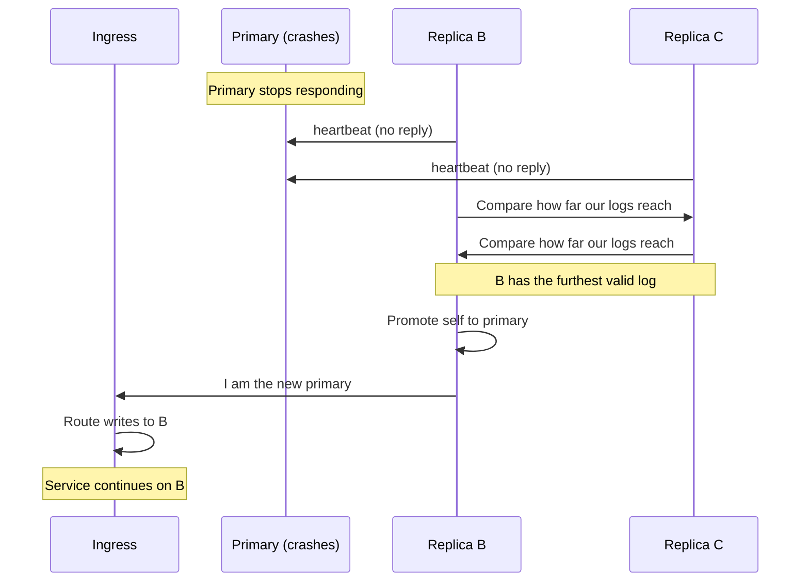
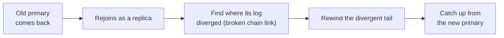

# Failover: self-healing

Failover is what happens when the primary goes away. The system should pick a
new primary on its own, lose no acknowledged data, and let the old primary
rejoin later. This page covers both the calm case and the crash case.

> **In plain terms**
>
> If the leader copy stops working, the other two copies notice, agree on which
> of them is most up to date, and make that one the new leader. The ingress
> starts sending writes to the new leader. When the broken one comes back, it
> quietly rejoins as a follower and catches up. You keep working the whole
> time.

## Two kinds of failover

### Planned switchover (graceful)

Sometimes a provider needs to take the primary down on purpose, for example for
maintenance. There is no need to lose anything.

1. The primary stops accepting new writes.
2. It waits until both replicas have caught up to the very end of its log.
3. It hands the primary role to a chosen replica.
4. The ingress starts routing writes to the new primary.

Because the replicas were fully caught up before the handover, **zero data is
lost** and there is no scramble.

### Unplanned failover (crash)

Sometimes the primary just disappears, for example a server crash or a network
cut. The replicas detect this because the primary stops answering regular
**heartbeats**.

The replica chosen as the new primary is the one whose **verified log reaches
furthest**, that is, the one holding the longest valid signed chain of entries
(see [durability](durability/#making-the-log-trustworthy-across-independent-providers)).
Picking the most up-to-date log matters: under the default
[quorum-synchronous](redundancy/#quorum-synchronous-the-default) setting every
acknowledged write is already on at least one replica, and that replica's log
reaches at least as far as the write, so the new primary still has it. No
acknowledged write is lost.

## Only one primary at a time

The danger during a failure is **split-brain**: two eVaults both believing they
are primary and both taking writes, which would split the data into two
diverging copies. This design prevents it in two ways:

- A replica only becomes primary with the **agreement of a majority** of the
  three. A single replica cannot promote itself alone.
- The **ingress routes writes to exactly one primary**. An old primary that was
  cut off from the others cannot keep serving writes through the ingress,
  because the ingress has already moved on. The old primary is **fenced off**:
  it is no longer allowed to act as primary until it rejoins properly.

> **In plain terms**
>
> There can only ever be one leader. A copy can only become leader if most of
> the copies agree, and the front door only ever sends writes to that one
> leader, so a confused old leader cannot keep taking changes on the side.

## The old primary rejoins

When the failed node comes back to life, it rejoins as a **replica**, not as
the primary. There is one subtlety: if it had acknowledged a few writes to
itself that never reached the others before it crashed (only possible under the
asynchronous setting), its log has a short tail that diverges from the new
primary's log.

It handles this by **rewinding** that divergent tail and then catching up from
the new primary, the same idea PostgreSQL calls `pg_rewind`. The hash-chain in
the log makes the exact point where the two logs diverge easy to find: it is the
first entry whose fingerprints stop matching.

## What clients and platforms see

- **Reads** keep working throughout, served by whichever replicas are alive.
- **A write in flight** at the instant of a crash may need to be retried; the
  client simply sends it again and the ingress routes it to the new primary.
- **Webhooks fire once.** The [Awareness Protocol](/docs/W3DS%20Protocol/Awareness-Protocol)
  notification for a committed change is sent by whoever is primary once the
  change is durable, and it is keyed by the change's log position. A failover in
  the middle therefore cannot make the same change notify twice or go
  un-notified.

## The Registry never moves

None of this touches the [Registry](/docs/Infrastructure/Registry). Throughout a
failover the user's eName still resolves to the **same ingress**. The leader
changing, the old primary rejoining, the rewind, all of it happens behind the
ingress. From the outside, the user's address never changed, which is exactly
the point of keeping the Registry dumb (see the [Overview](../#the-registry-stays-dumb)).
