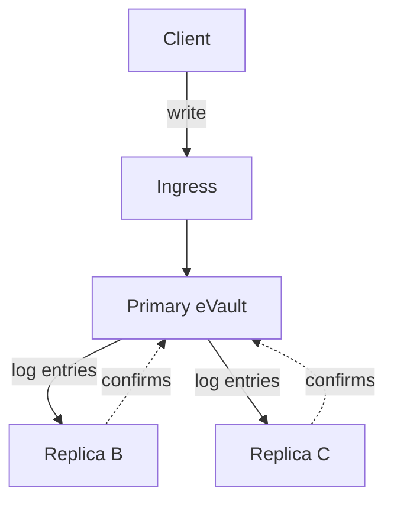
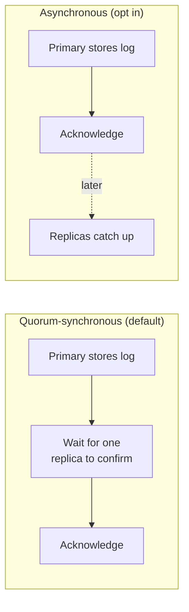

# Redundancy: replication

Redundancy means the same data lives on more than one machine at the same time,
so losing one machine loses nothing. The three eVaults stay identical by sharing
one thing: the [Write-Ahead Log](durability).

> **In plain terms**
>
> The primary copy keeps a running log of every change. It sends that same log
> to the other two copies, and they apply the changes in the same order. Do the
> same steps in the same order and you end up in the same place, so all three
> copies stay identical.

## The primary streams its log to the replicas

The primary is the only eVault that accepts writes. Every change it makes goes
into its log, and it ships each new log entry to the two replicas as it is
produced. The replicas apply the entries in order and so track the primary
exactly. Reads can be served by any of the three, which also spreads the load.

## How durable is "saved": you choose

When the primary tells a client "saved", how much should have happened first?
There is a genuine trade-off here, so it is **configurable per eVault**.

### Quorum-synchronous (the default)

The primary waits until **at least one replica** has also stored the log entry
durably before it acknowledges the write.

- **Benefit**: an acknowledged write now exists on at least two of the three
  machines. If any single machine dies, the write is still there. Nothing you
  were told was saved can be lost.
- **Cost**: each write waits for one network round trip to a replica, so it is
  a little slower.

This is the default because the whole point of the design is durability.

### Asynchronous (opt in)

The primary acknowledges as soon as **its own** log entry is durable, and ships
to the replicas in the background.

- **Benefit**: writes are as fast as a single machine; no waiting for anyone
  else.
- **Cost**: if the primary crashes in the brief window before a write reaches a
  replica, that newest write can be lost.

An eVault that values latency over the last few writes can opt into this.

## Replicas check every entry before applying it

Because the providers are independent, a replica does not blindly trust what it
receives. For every log entry the primary streams, the replica:

- checks that the entry's **signature** really comes from the primary, and
- checks that the entry's **previous-entry hash** matches the entry it already
  holds, so nothing was skipped or reordered.

If either check fails, the replica refuses the entry and raises the alarm rather
than corrupting its copy. This is the same tamper-evidence described on the
[durability page](durability/#making-the-log-trustworthy-across-independent-providers),
now doing its job during replication.

## Reads and replication lag

A replica can be a moment behind the primary, because the latest entries may
still be in flight. For most reads this does not matter. When it does matter,
for example when a client wants to read back something it just wrote, the
ingress routes that client's read to the primary, or to a replica it knows has
already caught up to that write. This keeps the simple guarantee that you can
always read your own latest change.

The next page, [failover](failover), covers what happens when the primary
itself goes away.
