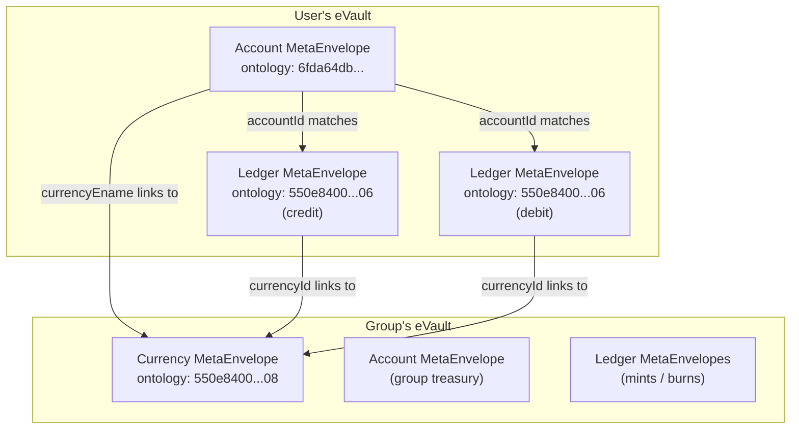
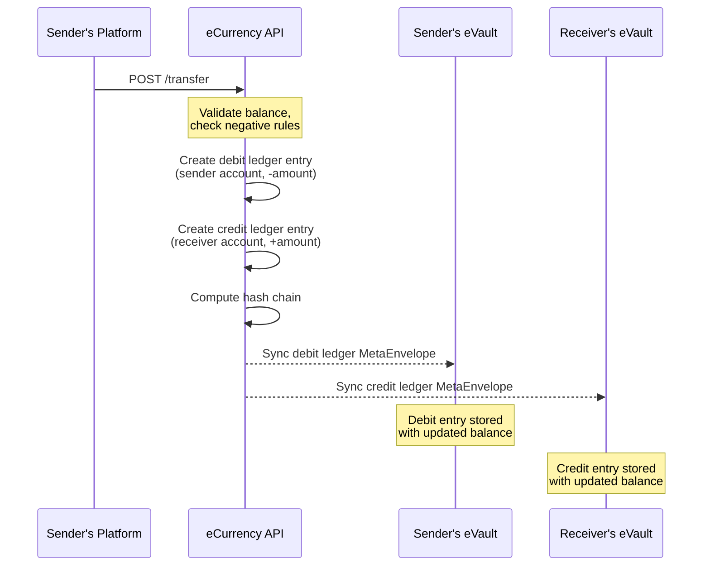
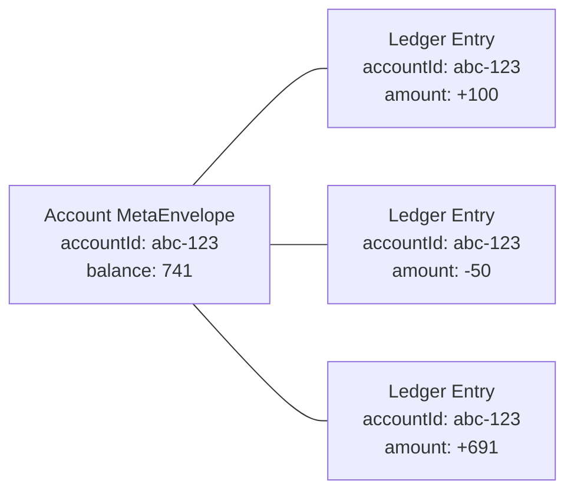

# eCurrency: Accounts and Ledger MetaEnvelopes

This guide covers how eCurrency stores account and transaction data as MetaEnvelopes on user eVaults. If you are building a feature that reads balances, displays transaction history, or initiates transfers, this is the reference you need.

## Ontology IDs

| Type | Ontology ID | Description |
|------|-------------|-------------|
| Ledger | `550e8400-e29b-41d4-a716-446655440006` | Individual transaction entries (debits/credits) |
| Currency | `550e8400-e29b-41d4-a716-446655440008` | Currency definitions |
| Account | `6fda64db-fd14-4fa2-bd38-77d2e5e6136d` | Account snapshots (holder + currency + balance) |

## Data Model Overview



## Account MetaEnvelope

An account represents a user's (or group's) holdings in a specific currency. One account MetaEnvelope exists per holder-currency pair.

### Payload Fields

| Field | Type | Description |
|-------|------|-------------|
| `accountId` | `string` | The holder's ID. Matches `accountId` on ledger MetaEnvelopes |
| `accountEname` | `string` | Global eName of the holder (prefixed with `@`) |
| `accountType` | `"user"` or `"group"` | Whether the holder is a user or a group treasury |
| `currencyEname` | `string` | Global eName of the currency (prefixed with `@`) |
| `currencyName` | `string` | Display name of the currency |
| `balance` | `number` | Current balance at time of creation |
| `createdAt` | `string` (ISO 8601) | When the first transaction on this account occurred |

### Example

```json
{
  "accountId": "f2a6743e-8d5b-43bc-a9f0-1c7a3b9e90d7",
  "accountEname": "@35a31f0d-dd76-5780-b383-29f219fcae99",
  "accountType": "user",
  "currencyEname": "@d8d3fbb7-70d1-46c6-b8ba-ae1ee701060c",
  "currencyName": "MetaCoin",
  "balance": 741,
  "createdAt": "2026-01-15T10:30:00.000Z"
}
```

### Where It Lives

Account MetaEnvelopes are stored on the **account holder's** eVault. A user who holds 3 different currencies will have 3 account MetaEnvelopes on their eVault.

## Ledger MetaEnvelope

Each ledger entry represents a single debit or credit. Transfers produce two ledger entries: one debit on the sender and one credit on the receiver.

### Payload Fields

| Field | Type | Description |
|-------|------|-------------|
| `currencyId` | `string` | ID of the currency (links to currency MetaEnvelope) |
| `accountId` | `string` | The account this entry belongs to |
| `accountType` | `"user"` or `"group"` | Type of account holder |
| `amount` | `number` | Signed amount. Positive for credits, negative for debits |
| `type` | `"credit"` or `"debit"` | Entry type |
| `description` | `string` | Human-readable description of the transaction |
| `senderAccountId` | `string` | Account ID of the sender (for transfers) |
| `senderAccountType` | `"user"` or `"group"` | Sender's account type |
| `receiverAccountId` | `string` | Account ID of the receiver (for transfers) |
| `receiverAccountType` | `"user"` or `"group"` | Receiver's account type |
| `balance` | `number` | Running balance after this entry |
| `hash` | `string` | SHA-256 hash of this entry (integrity chain) |
| `prevHash` | `string` | Hash of the previous entry in the chain |
| `createdAt` | `string` (ISO 8601) | When the entry was created |

### Example: Transfer

When Alice sends 50 MetaCoin to Bob, two ledger MetaEnvelopes are created:

**Debit on Alice's eVault:**

```json
{
  "currencyId": "d8d3fbb7-70d1-46c6-b8ba-ae1ee701060c",
  "accountId": "a1b2c3d4-...",
  "accountType": "user",
  "amount": -50,
  "type": "debit",
  "description": "Transfer to user:e5f6g7h8-...",
  "senderAccountId": "a1b2c3d4-...",
  "senderAccountType": "user",
  "receiverAccountId": "e5f6g7h8-...",
  "receiverAccountType": "user",
  "balance": 691,
  "hash": "a3f7...",
  "prevHash": "9c1d...",
  "createdAt": "2026-03-28T14:00:00.000Z"
}
```

**Credit on Bob's eVault:**

```json
{
  "currencyId": "d8d3fbb7-70d1-46c6-b8ba-ae1ee701060c",
  "accountId": "e5f6g7h8-...",
  "accountType": "user",
  "amount": 50,
  "type": "credit",
  "description": "Transfer from user:a1b2c3d4-...",
  "senderAccountId": "a1b2c3d4-...",
  "senderAccountType": "user",
  "receiverAccountId": "e5f6g7h8-...",
  "receiverAccountType": "user",
  "balance": 150,
  "hash": "b4e8...",
  "prevHash": "d2f0...",
  "createdAt": "2026-03-28T14:00:00.000Z"
}
```

### Where It Lives

Ledger MetaEnvelopes are stored on the eVault of the account holder for that entry. In a transfer, the debit lives on the sender's eVault and the credit lives on the receiver's eVault.

## Currency MetaEnvelope

Currencies are defined per group and stored on the eVaults of group admins.

### Payload Fields

| Field | Type | Description |
|-------|------|-------------|
| `name` | `string` | Currency display name |
| `description` | `string` | Currency description |
| `ename` | `string` | Global eName of the currency |
| `groupId` | `string` | ID of the group that owns this currency |
| `allowNegative` | `boolean` | Whether accounts can go below zero |
| `maxNegativeBalance` | `number` | Floor for negative balances (if allowed) |
| `allowNegativeGroupOnly` | `boolean` | If true, only group members can overdraft |
| `createdBy` | `string` | ID of the admin who created it |
| `createdAt` | `string` (ISO 8601) | Creation timestamp |

## Querying an eVault

### Get All Accounts for a User

```graphql
query GetAccounts {
  metaEnvelopes(
    filter: { ontologyId: "6fda64db-fd14-4fa2-bd38-77d2e5e6136d" }
    first: 100
  ) {
    edges {
      node {
        id
        parsed
      }
    }
  }
}
```

This returns all account MetaEnvelopes on the user's eVault. Each one represents a currency the user holds.

### Get Transaction History for a User

```graphql
query GetLedgerEntries {
  metaEnvelopes(
    filter: { ontologyId: "550e8400-e29b-41d4-a716-446655440006" }
    first: 50
  ) {
    edges {
      node {
        id
        parsed
      }
    }
    pageInfo {
      hasNextPage
      endCursor
    }
  }
}
```

### Filter by Currency

To get ledger entries for a specific currency, fetch all ledger MetaEnvelopes and filter client-side by `parsed.currencyId`.

## Transaction Flow



## Linking Accounts to Ledger Entries

The `accountId` field is the primary key that ties everything together:



To reconstruct the full picture for a given user and currency:

1. Query the eVault for account MetaEnvelopes (ontology `6fda64db-fd14-4fa2-bd38-77d2e5e6136d`)
2. Pick the account matching the desired `currencyEname`
3. Use `accountId` from that account to filter ledger MetaEnvelopes (ontology `550e8400-e29b-41d4-a716-446655440006`) where `parsed.accountId` matches

## Mint and Burn

Minting and burning operate on the **group treasury account** (where `accountType = "group"`).

- **Mint**: A credit entry is added to the group's account, increasing total supply
- **Burn**: A debit entry is added to the group's account, decreasing total supply

These entries have no `senderAccountId`/`receiverAccountId` since they are not transfers between two parties.

## Negative Balances

Currencies can be configured to allow negative balances:

| Setting | Behavior |
|---------|----------|
| `allowNegative = false` | Balance cannot go below 0 |
| `allowNegative = true` | Balance can go negative |
| `maxNegativeBalance = -500` | Balance cannot go below -500 |
| `allowNegativeGroupOnly = true` | Only group members can overdraft; non-members are capped at 0 |

## Hash Chain Integrity

Ledger entries form a hash chain per currency. Each entry's `hash` is computed from:

- All fields of the entry (id, currencyId, accountId, amount, type, etc.)
- The `prevHash` (hash of the previous entry in that currency's chain)

This means tampering with any historical entry breaks the chain for all subsequent entries.
